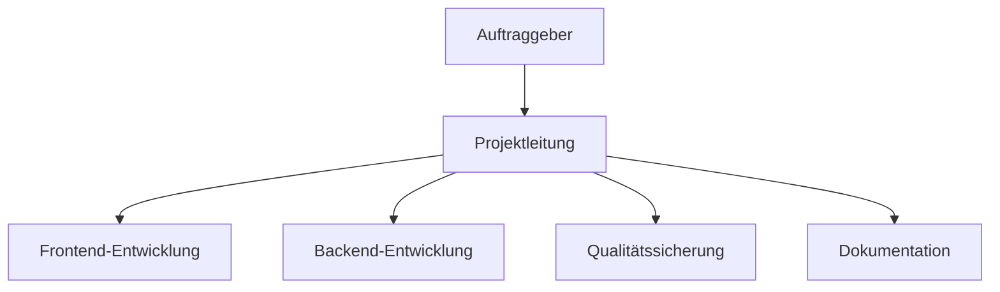

## 4. Projektorganisation

Die Projektorganisation von YADRMS basiert auf klar definierten Rollen und Verantwortlichkeiten. Jedes Teammitglied hat spezifische Aufgaben und Bereiche, für die es verantwortlich ist.

**Projektleitung (Isaac Lins):**
Isaac Lins übernimmt die Projektleitung und ist für die Gesamtkoordination verantwortlich. Er plant die Termine, überwacht den Fortschritt und sorgt dafür, dass alle Teammitglieder ihre Aufgaben erfüllen können.

**Frontend-Entwicklung (Kenta Waibel):**
Kenta Waibel ist für die Entwicklung der Weboberfläche zuständig. Seine Aufgaben umfassen die Erstellung der Benutzeroberfläche, die Integration mit dem Backend und die Optimierung der Benutzererfahrung.

**Backend-Entwicklung (Oliver Zenger):**
Oliver Zenger entwickelt das Backend-System und die API-Schnittstellen. Er ist verantwortlich für die Serversoftware und die Verbindung zur Discord-API. Seine Arbeit bildet die Grundlage für alle anderen Systemkomponenten.

**Modulentwicklung (Joel Furter):**
Joel Furter konzentriert sich auf die Entwicklung der verschiedenen Module für das System. Er erstellt die Plugins und Funktionen, die später von den Clients verwendet werden. Dazu gehören Module für Screenshots, Systemsteuerung und andere Remote-Funktionen.

Schlussendlich haben wir eine Tabelle, indem alles übersichtlich dargestellt wird.

| Rolle                | Name/Person                 | Verantwortlichkeiten                   |
| -------------------- | --------------------------- | -------------------------------------- |
| Projektleitung       | Isaac Lins                  | Steuerung, Zeitplan, Reporting         |
| Frontend-Entwicklung | Kenta Waibel, Oliver Zenger | UI/UX, BuilderUI, API-Anbindung        |
| Backend-Entwicklung  | Joel Furter                 | Python-Builder, Module, Schnittstellen |
| Dokumentation        | YADRMS-TEAM (Alle)          | How-To, Anwenderdoku, Protokolle       |
| Auftraggeber         | Jay-Leo Nagel               | Anforderungen, Feedback, Abnahme       |

### 4.1 Kommunikationsstrukturen

Die Kommunikation im YADRMS-Projekt folgt klaren Strukturen und Regeln. Das stellt sicher, dass alle Informationen rechtzeitig und an die richtigen Personen weitergegeben werden.

**Interne Kommunikation:**
Die tägliche Kommunikation findet hauptsächlich über Discord statt. Das Team hat einen eigenen Server mit verschiedenen Kanälen für unterschiedliche Themen. Es gibt separate Kanäle für Entwicklung, Dokumentation, Fragen und allgemeine Diskussionen. Diese Struktur hilft dabei, Informationen zu organisieren und schnell zu finden.

**Regelmässige Meetings:**
Das Team führt wöchentliche Meetings durch, um den Fortschritt zu besprechen und Probleme zu lösen. Diese Meetings finden jeden Montag statt und dauern maximal eine Stunde. Alle Teammitglieder berichten über ihre Arbeit und diskutieren anstehende Aufgaben.

### 4.2 Arbeitsaufteilung und Koordination

Die Arbeitsaufteilung im YADRMS-Projekt ist klar strukturiert. Jedes Teammitglied hat seine Hauptverantwortlichkeit, aber es gibt auch Überschneidungen und Zusammenarbeit zwischen den Bereichen.

**Hauptverantwortlichkeiten:**
Jeder Entwickler ist für seinen Bereich hauptverantwortlich. Das bedeutet, dass er die Entscheidungen für seinen Bereich trifft und die Qualität seiner Arbeit verantwortet. Gleichzeitig ist er aber auch verpflichtet, die anderen Teammitglieder zu unterstützen, wenn sie Hilfe brauchen.

**Zusammenarbeit:**
Die verschiedenen Bereiche müssen eng zusammenarbeiten. Der Frontend-Entwickler muss zum Beispiel mit dem Backend-Entwickler abstimmen, um die Schnittstellen zu definieren.

### 4.3 Ressourcenmanagement

Um eine effiziente Projektabwicklung zu gewährleisten, wird die verfügbare Zeit realistisch geplant und auf die verschiedenen Aufgaben verteilt. Das Team verwendet ein Kanban-Board, um den Fortschritt zu verfolgen und Engpässe zu identifizieren. Die Arbeitsbelastung wird gleichmässig auf alle Teammitglieder verteilt, wobei die individuellen Stärken und Interessen berücksichtigt werden. Wenn jemand überlastet ist, wird die Arbeit umverteilt oder zusätzliche Unterstützung organisiert.

Alle benötigten Tools und Technologien werden zu Beginn des Projekts identifiziert und organisiert. Das Team nutzt kostenlose und Open-Source-Tools, wo immer möglich. Wenn kostenpflichtige Tools benötigt werden, haben die Pech.

Potenzielle Risiken werden regelmässig besprochen und bewertet. Für die wichtigsten Risiken werden Notfallpläne erstellt. Das Team führt regelmässige Risikoanalysen durch und passt die Pläne bei Bedarf an.
