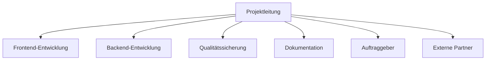

# Projektorganisation (final) – YADRMS

## Ziel
Die endgültige Organisation des Projekts umfasst die Strukturierung des Teams, Zuweisung von Aufgaben und Verantwortlichkeiten sowie die Festlegung von Prozessen zur erfolgreichen Durchführung des Projekts.

---

## 1. Projektteam & Rollenverteilung

### Organigramm (Mermaid)

### Rollen, Verantwortlichkeiten & Zuordnung

| Rolle                | Name/Person         | Verantwortlichkeiten                        |
|----------------------|---------------------|---------------------------------------------|
| Projektleitung       | Isaac Lins      | Steuerung, Zeitplan, Eskalation, Reporting  |
| Frontend-Entwicklung | YADRMS-TEAM       | UI/UX, BuilderUI, API-Anbindung             |
| Backend-Entwicklung  |  YADRMS-TEAM         | Python-Builder, Module, Schnittstellen      |
| Qualitätssicherung   |  YADRMS-TEAM           | Tests, Reviews, Abnahme                     |
| Dokumentation        |  YADRMS-TEAM      | How-To, Anwenderdoku, Protokolle            |
| Auftraggeber         | Jay Nagel          | Anforderungen, Feedback, Abnahme            |
| Externe Partner      | (Discord)     | Beratung, Support                           |

---

## 2. Finaler Projektstrukturplan (PSP) & Arbeitspakete

- Im Dokument [Projektstruktur und Arbeitspakete]() finden sie die finale Projektstruktur und Arbeitspakete
- Arbeitspakete wurden priorisiert und Abhängigkeiten final geklärt
- Kritische Pfade: UI/UX → BuilderUI → API-Anbindung → Integration → Systemtests

**Prioritäten:**
1. Grundfunktionalität (BuilderUI, Python-Builder, API)
2. Modulerweiterung & Testing
3. Dokumentation & Abschluss

**Abhängigkeiten:**
- API-Anbindung benötigt fertige Backend-Schnittstellen
- Systemtests erst nach Integration möglich

---

## 3. Projektmethoden & Tools

| Bereich           | Tool/Methodik         | Beschreibung                        |
|-------------------|----------------------|--------------------------------------|
| Zusammenarbeit    | Microsoft Teams, Discord       | Teamkommunikation, schnelle Abstimmung|
| Aufgabenmanagement| GitHub Issues/Boards | Aufgaben, Status, Backlog, Review    |
| Dokumentation     | Notion, Markdown     | Projektdoku, Protokolle, How-To      |
| Meetings          | Microsoft Teams      | Regelmeetings, Screen-Sharing        |
| Projektmanagement | Kanban (GitHub)      | Sprintplanung, Aufgabenverfolgung     |
| Zeitplanung       | Gantt-Diagramm       | Zeitliche Planung, Meilensteine      |

- **Methodik:** Kanban (iterativ, flexibel, mit Backlog und Sprints)
- **Deadlines:** Werden im Gantt-Chart und GitHub Board gepflegt

---

## 4. Kommunikationswege & Meetingstruktur

| Kommunikationsweg     | Zweck/Inhalt                | Frequenz           | Verantwortlich         |
|----------------------|-----------------------------|--------------------|------------------------|
| Weekly Meeting       | Status, Planung             | 1× pro Woche       | Projektleitung         |
| Statusbericht        | Fortschritt, Blocker        | Alle 2 Wochen      | Teammitglieder         |
| Ad-hoc-Meeting       | Eskalation, Freigabe        | Nach Bedarf        | Projektleitung         |
| GitHub Issues/Boards | Aufgaben, Status, Review    | Laufend            | Entwickler, Tester     |

- **Eskalationsweg:** Blocker werden im Weekly oder per E-Mail an die Projektleitung gemeldet. Kritische Themen werden kurzfristig in Ad-hoc-Meetings behandelt.

---

## 5. Ressourcenplanung

| Ressource                | Verfügbarkeit / Planung         |
|-------------------------|----------------------------------|
| Entwickler (FE/BE)      | 2× Vollzeit                      |
| QA                      | 1× Vollzeit                      |
| Dokumentation           | 1× Vollzeit                      |
| Technische Infrastruktur| GitHub, Cloud, Testsysteme       |
| Budget                  | Nach Aufwand  |

- Ressourcen werden im Projektboard und Gantt-Chart eingeplant
- Verfügbarkeit wird regelmäßig im Weekly überprüft

---

## 6. Risikomanagement & Controlling

### Risiken & Maßnahmen
| Risiko                        | Eintrittswahrscheinlichkeit | Auswirkung | Gegenmaßnahme                        |
|-------------------------------|-----------------------------|------------|--------------------------------------|
| Verzögerung bei Schnittstellen| Mittel                      | Hoch       | Frühe Abstimmung, API-Tests          |
| Personalausfall               | Niedrig                     | Mittel     | Vertretungsregel, Wissensdoku        |
| Technische Probleme           | Mittel                      | Hoch       | Prototyping, regelmäßige Tests       |
| Unklare Anforderungen         | Mittel                      | Hoch       | Regelmäßige Reviews, Abnahme         |

### Controlling
Alle zwei Wochen werden Statusberichte erstellt. Die Arbeitspakete werden im  Weekly  überprüft. Der Fortschritt wird über ein GitHub Board und ein Gantt-Chart angezeigt. Falls es Abweichungen oder Probleme gibt, wird die Planung angepasst.

---
**Legende:**
- YADRMS-TEAM = Isaac Lins, Oliver Zenger, Joel Furter, Kenta Waibel

---
**Mit dieser finalen Projektorganisation sind alle Rollen, Verantwortlichkeiten, Methoden und Prozesse klar geregelt. Sie bildet die Grundlage für eine erfolgreiche und transparente Projektdurchführung.** 