# Projektstruktur – YADRMS

## Ziel
Die Projektstruktur zerlegt das Gesamtprojekt in übersichtliche Teilaufgaben und Arbeitspakete. Dies ermöglicht eine klare Aufgabenverteilung, erleichtert das Controlling und bildet die Grundlage für Zeit- und Ressourcenplanung.

---

## 1. Projektstrukturplan (PSP)

### Hierarchische Gliederung

1. Projektstart & Planung
    1.1 Anforderungsanalyse
    1.2 Grob- & Detailkonzept
    1.3 Projektstruktur & Arbeitspakete
2. Entwicklung
    2.1 Frontend-Entwicklung
        2.1.1 UI/UX Design
        2.1.2 Implementierung BuilderUI
        2.1.3 API-Anbindung
        2.1.4 Testing & Review
    2.2 Backend-Entwicklung
        2.2.1 Python-Builder
        2.2.2 Modulentwicklung
        2.2.3 Schnittstellen/API
        2.2.4 Testing & Review
3. Integration & Test
    3.1 Integration Frontend/Backend
    3.2 Systemtests
    3.3 User Acceptance Test
4. Dokumentation & Abschluss
    4.1 Nutzwertanalyse
    4.2 Detailkonzept
    4.3 How-To & Anwenderdoku
    4.4 Projektabschluss & Übergabe

### Visuelle Darstellung (Mermaid Baumstruktur)

```mermaid
graph TD
    A[Projektstart & Planung]
    B[Entwicklung]
    C[Integration & Test]
    D[Dokumentation & Abschluss]

    A1(Anforderungsanalyse)
    A2(Grob- & Detailkonzept)
    A3(Projektstruktur & APs)
    B1(Frontend-Entwicklung)
    B2(Backend-Entwicklung)
    B1a(UI/UX Design)
    B1b(BuilderUI)
    B1c(API-Anbindung)
    B1d(Testing & Review)
    B2a(Python-Builder)
    B2b(Modulentwicklung)
    B2c(Schnittstellen/API)
    B2d(Testing & Review)
    C1(Integration Frontend/Backend)
    C2(Systemtests)
    C3(User Acceptance Test)
    D1(Nutzwertanalyse)
    D2(Detailkonzept)
    D3(How-To & Anwenderdoku)
    D4(Projektabschluss & Übergabe)

    A --> A1
    A --> A2
    A --> A3
    B --> B1
    B --> B2
    B1 --> B1a
    B1 --> B1b
    B1 --> B1c
    B1 --> B1d
    B2 --> B2a
    B2 --> B2b
    B2 --> B2c
    B2 --> B2d
    C --> C1
    C --> C2
    C --> C3
    D --> D1
    D --> D2
    D --> D3
    D --> D4
```

---

**Dieser Projektstrukturplan bildet die Grundlage für die weitere Zeit- und Ressourcenplanung wie in unserem Gantt-Chart und das Projektcontrolling.** 