# Projektstruktur und Arbeitspakete – YADRMS

## Ziel
Die Projektstruktur zerlegt das Gesamtprojekt in übersichtliche Teilaufgaben und Arbeitspakete. Dies ermöglicht eine klare Aufgabenverteilung, erleichtert das Controlling und bildet die Grundlage für Zeit- und Ressourcenplanung.

---

## 1. Projektstrukturplan (PSP)

### Hierarchische Gliederung

1. Projektstart & Planung
    1.1 Anforderungsanalyse
    1.2 Grob- & Detailkonzept
    1.3 Projektstruktur & Arbeitspakete
2. Entwicklung
    2.1 Frontend-Entwicklung
        2.1.1 UI/UX Design
        2.1.2 Implementierung BuilderUI
        2.1.3 API-Anbindung
        2.1.4 Testing & Review
    2.2 Backend-Entwicklung
        2.2.1 Python-Builder
        2.2.2 Modulentwicklung
        2.2.3 Schnittstellen/API
        2.2.4 Testing & Review
3. Integration & Test
    3.1 Integration Frontend/Backend
    3.2 Systemtests
    3.3 User Acceptance Test
4. Dokumentation & Abschluss
    4.1 Nutzwertanalyse
    4.2 Detailkonzept
    4.3 How-To & Anwenderdoku
    4.4 Projektabschluss & Übergabe

### Visuelle Darstellung (Mermaid Baumstruktur)

```mermaid
graph TD
    A[Projektstart & Planung]
    B[Entwicklung]
    C[Integration & Test]
    D[Dokumentation & Abschluss]

    A1(Anforderungsanalyse)
    A2(Grob- & Detailkonzept)
    A3(Projektstruktur & APs)
    B1(Frontend-Entwicklung)
    B2(Backend-Entwicklung)
    B1a(UI/UX Design)
    B1b(BuilderUI)
    B1c(API-Anbindung)
    B1d(Testing & Review)
    B2a(Python-Builder)
    B2b(Modulentwicklung)
    B2c(Schnittstellen/API)
    B2d(Testing & Review)
    C1(Integration Frontend/Backend)
    C2(Systemtests)
    C3(User Acceptance Test)
    D1(Nutzwertanalyse)
    D2(Detailkonzept)
    D3(How-To & Anwenderdoku)
    D4(Projektabschluss & Übergabe)

    A --> A1
    A --> A2
    A --> A3
    B --> B1
    B --> B2
    B1 --> B1a
    B1 --> B1b
    B1 --> B1c
    B1 --> B1d
    B2 --> B2a
    B2 --> B2b
    B2 --> B2c
    B2 --> B2d
    C --> C1
    C --> C2
    C --> C3
    D --> D1
    D --> D2
    D --> D3
    D --> D4
```

---

## 2. Arbeitspakete (APs)

| AP-Nr. | Bezeichnung                | Ziel/Inhalt                                         | Zuständig         | Dauer/Aufwand | Abhängigkeiten         | Ergebnis (Deliverable)           |
|--------|----------------------------|-----------------------------------------------------|-------------------|---------------|-----------------------|-----------------------------------|
| 1.1    | Anforderungsanalyse        | Anforderungen erfassen und dokumentieren             | PO, Team          | 2 PT          | -                     | Anforderungsliste                 |
| 1.2    | Grob- & Detailkonzept      | Lösungskonzept und Detailkonzept erstellen           | PO, Architekt     | 3 PT          | 1.1                   | Grobkonzept, Detailkonzept        |
| 1.3    | Projektstruktur & APs      | PSP und Arbeitspakete definieren                     | PM, Team          | 1 PT          | 1.2                   | PSP, AP-Liste                     |
| 2.1.1  | UI/UX Design               | Mockups, UI-Design, Userflows                        | Frontend          | 2 PT          | 1.2                   | Mockups, Designvorlagen           |
| 2.1.2  | Implementierung BuilderUI  | Umsetzung der Konfigurationsoberfläche               | Frontend          | 4 PT          | 2.1.1                 | BuilderUI-Komponente              |
| 2.1.3  | API-Anbindung              | Anbindung der UI an die Backend-APIs                 | Frontend          | 2 PT          | 2.1.2, 2.2.3          | Funktionierende API-Integration   |
| 2.1.4  | Testing & Review (FE)      | Komponententests, UI-Tests, Code-Review              | Frontend          | 2 PT          | 2.1.3                 | Testprotokolle, Reviewberichte    |
| 2.2.1  | Python-Builder             | Script-Generator für Python-Clients                  | Backend           | 3 PT          | 1.2                   | builder.py, Output-Logik          |
| 2.2.2  | Modulentwicklung           | Entwicklung und Integration von Beispielmodulen      | Backend           | 3 PT          | 2.2.1                 | Module (z.B. Screenshot, BSOD)    |
| 2.2.3  | Schnittstellen/API         | API-Endpoints für Settings, Compile, Logs etc.       | Backend           | 2 PT          | 2.2.1                 | API-Routen, Schnittstellendoku    |
| 2.2.4  | Testing & Review (BE)      | Modultests, Integrationstests, Code-Review           | Backend           | 2 PT          | 2.2.2, 2.2.3          | Testprotokolle, Reviewberichte    |
| 3.1    | Integration FE/BE         | Zusammenführung von Frontend und Backend             | Dev-Team          | 2 PT          | 2.1.4, 2.2.4          | Integriertes System               |
| 3.2    | Systemtests                | End-to-End-Tests, Fehlerbehebung                     | Dev-Team          | 2 PT          | 3.1                   | Testprotokolle, Fehlerliste       |
| 3.3    | User Acceptance Test       | Abnahme durch Product Owner                          | PO, User          | 1 PT          | 3.2                   | Abnahmeprotokoll                  |
| 4.1    | Nutzwertanalyse            | Nutzwertanalyse dokumentieren                        | PM, Team          | 1 PT          | 1.1                   | 6_0_Nutzwertanalyse.md                |
| 4.2    | Detailkonzept              | Detailkonzept dokumentieren                          | PM, Architekt     | 1 PT          | 1.2                   | 5_0_Detailkonzept.md                  |
| 4.3    | How-To & Anwenderdoku      | Anwender- und Entwicklerdokumentation                | Team              | 2 PT          | 3.3                   | How-To.md, Readme, User Guide     |
| 4.4    | Projektabschluss & Übergabe| Abschluss, Lessons Learned, Übergabe                 | PM, Team          | 1 PT          | 4.3                   | Abschlussbericht, Übergabeprotokoll|

**Legende:**
- PT = Personentage
- PO = Product Owner
- PM = Projektmanager
- FE = Frontend, BE = Backend

---

**Dieser Projektstrukturplan und die Arbeitspakete bilden die Grundlage für die weitere Zeit- und Ressourcenplanung (z. B. Gantt-Chart) und das Projektcontrolling.** 