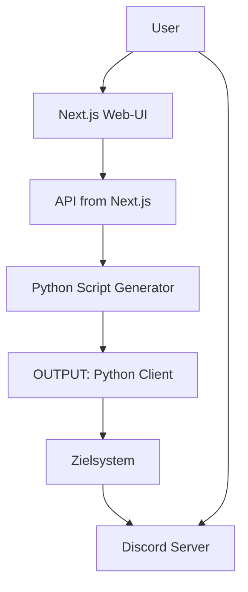
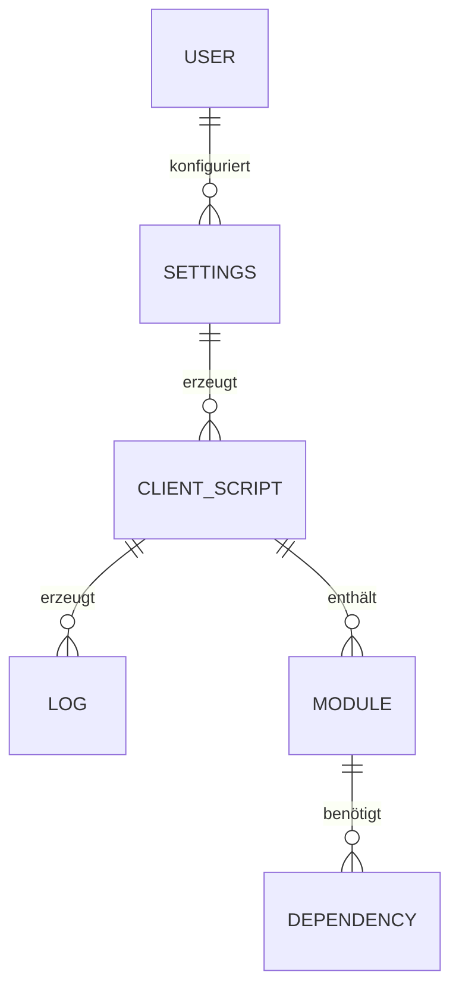

# Detailkonzept – YADRMS

## Ziel
Das Detailkonzept konkretisiert die im Grobkonzept definierte Lösung. Es beschreibt die technische, funktionale und organisatorische Umsetzung im Detail und dient als Basis für die Realisierung des Projekts.

---

## 1. Technisches Konzept

### Eingesetzte Tools, Frameworks & Sprachen

| Komponente   | Technologie/Tool                |
|--------------|---------------------------------|
| Frontend     | Next.js (React, TypeScript), TailwindCSS, ShadCN UI, Radix UI |
| Backend      | Python 3.8+, Modular Scripting  |
| API          | Next.js API Routes              |
| Datenhaltung | JSON-Dateien (Settings, Logs)   |
| Sonstiges    | Discord API, Node.js, Playwright, Jest, Mocha |

### Architekturübersicht

- **Architektur:** Microservice-orientiert, Client-Server-Modell
- **Frontend:** Web-App (Next.js) für Konfiguration, Steuerung und Monitoring
- **Backend:** Python-Script-Generator, modulare Komponenten
- **Kommunikation:** REST-APIs (Next.js), Dateibasierte Übergabe (Settings, Output)
- **Drittanbieter:** Discord als Kommunikationskanal

---

## 2. Funktionales Konzept

### Hauptfunktionen

| Funktion                | Input                        | Ablauf (Kurz)                                                                 | Output                        |
|-------------------------|------------------------------|-------------------------------------------------------------------------------|-------------------------------|
| Bot-Konfiguration       | Token, Guild-ID, Module      | User gibt Daten im UI ein, speichert Settings                                 | settings.json                  |
| Client-Generierung      | Settings                     | API ruft Python-Builder auf, generiert Script                                 | Python-Client im OUTPUT        |
| Bot-Deployment          | Python-Client                | User startet Script auf Zielsystem                                            | Bot verbindet zu Discord       |
| Remote-Steuerung        | Discord-Commands             | User sendet .Befehle an Bot, dieser führt sie aus                             | Antwort im Discord-Channel     |
| Live-Monitoring         | -                            | UI zeigt Logs und Status in Echtzeit                                          | Log-Stream im UI               |
| Modulerweiterung        | Python-Modul                 | Entwickler legt neues Modul im Backend ab                                     | Modul erscheint im UI          |

### Optional: UI-Mockup (Beschreibung)
- **BuilderUI:** Übersichtliche Eingabemaske für Token, Guild-ID, Modulauswahl, Kompilieren-Button, Log-Viewer.
- **Testing Panel:** Start/Stop-Button, Dropdown für Scripts, Live-Log-Ausgabe.

---

## 3. Ablaufbeschreibung (Nutzerflüsse)

### Beispiel: Bot-Konfiguration & Deployment
1. User öffnet die Web-App (BuilderUI)
2. Gibt Discord-Bot-Token, Guild-ID und wählt Module aus
3. Speichert die Konfiguration (Settings werden als JSON abgelegt)
4. Klickt auf "Kompilieren" – API ruft Python-Builder auf
5. Generiertes Python-Script wird im OUTPUT-Ordner bereitgestellt
6. User lädt Script herunter und startet es auf dem Zielsystem
7. Bot verbindet sich mit Discord und erstellt/verwaltet einen Channel
8. User steuert das Zielsystem über Discord-Kommandos

### Beispiel: Remote-Befehl
1. User sendet z. B. `.screenshot` im Discord-Channel
2. Bot empfängt Befehl, führt Modul aus
3. Ergebnis (z. B. Screenshot) wird als Nachricht/Datei im Channel gepostet

---

## 4. Daten- und Informationskonzept

### Datenmodell (vereinfachtes ERD)

### Datenquellen & Speicherorte
- **Settings:** `backend/settings/settings.json`
- **Module:** `backend/languages/python/components/done/`
- **Generierte Clients:** `OUTPUT/`
- **Logs:** Temporär im Backend, Anzeige im UI
- **Discord:** Kommunikationsschnittstelle, keine persistente Speicherung

---

## 5. Testkonzept

| Testart                | Beschreibung                                      | Verantwortlich      | Zeitraum         |
|------------------------|---------------------------------------------------|---------------------|------------------|
| Unit-Tests (Frontend)  | Komponenten- und Logiktests mit Jest, Playwright  | Entwickler Frontend | Laufend          |
| Unit-Tests (Backend)   | Modultests für Python-Komponenten                 | Entwickler Backend  | Laufend          |
| Integrationstests      | End-to-End-Tests UI ↔ API ↔ Backend               | Dev-Team           | Vor jedem Release|
| User Acceptance Test   | Funktionaler Test durch Endnutzer                 | Product Owner       | Vor Go-Live      |

---

## 6. Zielsystem / Zielzustand

Nach erfolgreicher Umsetzung steht ein modulares, webbasiertes Remote-Management-System zur Verfügung, das:
- Über eine moderne UI (Next.js) konfigurierbar ist
- Individuelle Python-Clients generiert
- Remote-Steuerung und Monitoring via Discord ermöglicht
- Einfach um neue Module erweiterbar ist
- Logs und Status in Echtzeit anzeigt
- Sicher und wartbar im eigenen Netzwerk betrieben werden kann

**Am Ende verfügbar:**
- Web-UI (BuilderUI, Testing Panel)
- API-Schnittstellen
- Python-Client-Generator
- Dokumentation (Nutzwertanalyse, Detailkonzept, How-To)
- Beispielmodule (Screenshot, Clipboard, Ghostwriting, Wallpaper, BSOD)

---

**Dieses Detailkonzept dient als verbindliche Grundlage für die weitere Projektumsetzung und die Erstellung des Gantt-Charts.** 
