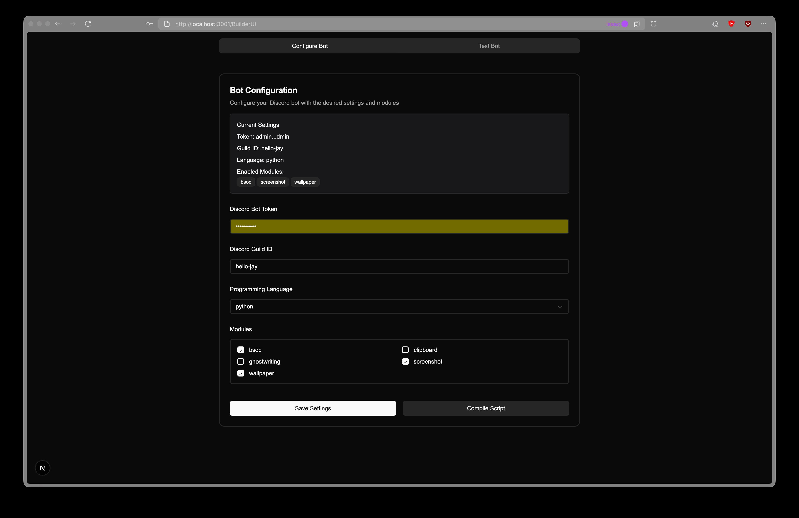
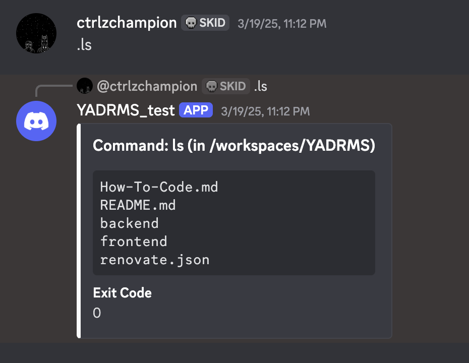

## 7.0 Prototyp

Wir haben ein Prototyp erstellt, der die Grundfunktionalität des YADRMS-Projekts zeigt.

Man kann folgende Module auswählen:

- bsod
- clipboard
- screenshot
- ghostwriting
- wallpaper

Dazu haben wir eine Öffentliche Dokumentation, die Unter https://isaaclins.com/YADRMS/ zu finden ist.

Beim Kompilieren wird der Client durch die Python Script Generator generiert. Dieser generiert einen Python Client, der dann auf dem Zielsystem ausgeführt werden kann. Dieser Client kann dann in Discord mit dem Bot kommunizieren und die gewünschten Aktionen ausführen.

Hier ist ein Screenshot des Prototyps:

Beim Ausführen von Commands würde dies so aussehen:

