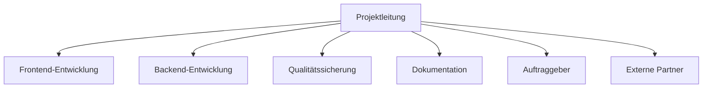
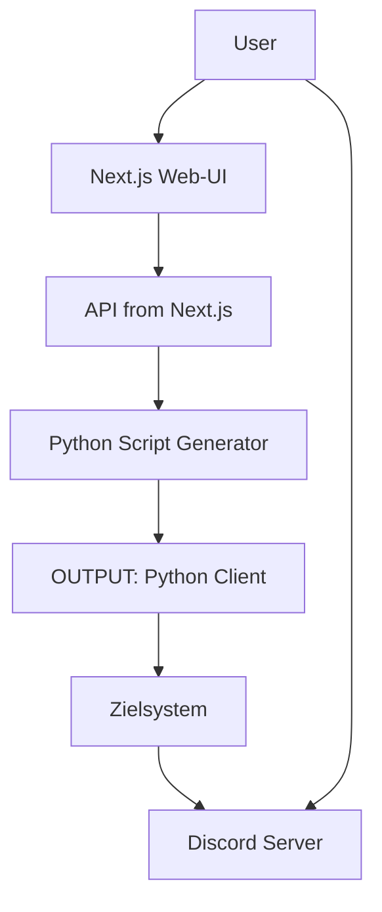
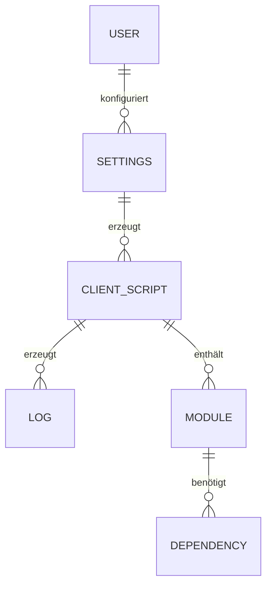

# 01 Management Summary – YADRMS

## Projektziel und Kontext

YADRMS (Yet Another Discord Remote Management Software) ist ein modulares Remote-Management-System, das Discord als Kommunikationskanal nutzt. Ziel des Projekts war es, eine flexible, sichere und einfach erweiterbare Lösung für die Fernsteuerung und Überwachung von Systemen zu schaffen – insbesondere für den Einsatz in kontrollierten, nicht-produktiven Umgebungen.

---

## Hauptziele und Ergebnisse

- Entwicklung einer modernen, webbasierten Benutzeroberfläche (Next.js) zur Konfiguration und Steuerung von Remote-Clients
- Automatisierte Generierung individueller Python-Clients mit modularen Funktionen
- Integration von Discord als zentrale Steuer- und Monitoring-Plattform
- Bereitstellung von Beispielmodulen (z. B. Screenshot, Clipboard, Ghostwriting, Wallpaper, BSOD)
- Implementierung eines flexiblen API- und Modulsystems für zukünftige Erweiterungen
- Erstellung umfassender Projektdokumentation (Nutzwertanalyse, Detailkonzept, PSP, Kommunikationskonzept)

---

## Schlüsselerkenntnisse und Ergebnisse

- Die Nutzung von Discord als C2-Kanal ermöglicht eine intuitive und sichere Steuerung, ohne eigene Server-Infrastruktur betreiben zu müssen.
- Die modulare Architektur erlaubt eine schnelle Erweiterung und Anpassung an neue Anforderungen.
- Die klare Trennung von Frontend, Backend und Modulen vereinfacht Wartung und Weiterentwicklung.
- Die Projektmethodik (Kanban, regelmäßige Reviews, klare Arbeitspakete) hat zu hoher Transparenz und Effizienz geführt.

---

## Herausforderungen und Lösungen

- **Schnittstellenintegration:** Die Abstimmung zwischen Frontend, Backend und Discord-API erforderte intensive Tests und frühe Prototypen.
- **Sicherheit:** Die sichere Handhabung von Tokens und Zugriffsrechten wurde durch klare Guidelines und isolierte Settings gewährleistet.
- **Modularität:** Die Entwicklung eines flexiblen Modulsystems war komplex, wurde aber durch einheitliche Schnittstellen und klare Dokumentation gelöst.
- **Ressourcenplanung:** Engpässe im Team wurden durch Priorisierung und flexible Aufgabenverteilung kompensiert.

---

## Zukünftige Perspektiven

- **Funktionserweiterung:** Entwicklung weiterer Module (z. B. Dateiübertragung, Remote-Desktop, erweiterte Monitoring-Features)
- **Plattformunterstützung:** Ausbau auf weitere Programmiersprachen und Betriebssysteme
- **Sicherheit:** Implementierung zusätzlicher Authentifizierungs- und Verschlüsselungsmechanismen
- **Automatisierung:** Integration von CI/CD für schnellere Releases und automatisierte Tests
- **Community & Open Source:** Öffnung für externe Beiträge und Ausbau der Dokumentation

---

# 02 6-3-5 Methode

| Team-Mitglieder   | Idee 1                                                 | Idee 2                                               | Idee 3                                                 |
| ----------------- | ------------------------------------------------------ | ---------------------------------------------------- | ------------------------------------------------------ |
| **Isaac Lins**    | SmartPlant – Eine App zur automatischen Pflanzenpflege | Automatisierte Remote-Management-System für Geräte   | StudyBuddy – Lernplattform für Studierende             |
| **Kenta Waibel**  | Sensorintegration für Feuchtigkeits- und Lichtmessung  | Easy management, no coding-knowledge für gebrauch    | KI-gestützte Lernempfehlungen für Studierende          |
| **Oliver Zenger** | Push-Benachrichtigungen bei Giessbedarf                | Discord als Kommunikationskanal für Remote-Steuerung | Integration von Lernstatistiken und Fortschrittsbalken |
| **Joel Furter**   | Community-Feature zum Pflanzentausch                   | Modulare Architektur für einfache Erweiterbarkeit    | Peer-to-Peer-Lernräume mit Videochat                   |
| **Nino Sigrist**  | Automatische Pflanzenidentifikation per Foto           | Webbasierte UI für Konfiguration und Monitoring      | Mobile App für schnellen Zugriff auf Lerninhalte       |
| **Eris Jakupi**   | Wetterdaten-Integration für optimale Pflegehinweise    | Automatische Python-Client-Generierung               | Gamification: Badges für Lernziele und Challenges      |

# 02-01 Projektidee – Beschreibung: YADRMS

## Ziele / Erwarteter Nutzen

Entwicklung und Dokumentation einer klaren, innovativen und umsetzbaren Projektidee für **YADRMS (Yet Another Discord Remote Management Software)**, die den Anforderungen der End-Dokumentation entspricht und einen echten Nutzen für Bildungszwecke stiftet.

## 1. Beschreibung des Grundproblems bzw. Bedarfs

In der modernen IT-Ausbildung und im Bereich der Cybersecurity-Bildung besteht ein wachsender Bedarf an praktischen, hands-on Lernerfahrungen. Traditionelle Lernansätze sind oft zu theoretisch und bieten wenig Gelegenheit, reale Systemarchitekturen und Technologie-Integrationen zu verstehen.

**Identifizierte Probleme:**

- Mangel an praktischen Demonstrationstools für moderne Softwarearchitekturen
- Komplexität beim Erlernen von Client-Server-Kommunikation und API-Integration
- Fehlende zugängliche Plattformen für das Experimentieren mit modularen Systemen
- Bedarf an sicheren, kontrollierten Umgebungen für Remote-Management-Konzepte

## 2. Zielgruppenanalyse: Wer profitiert vom Projekt?

### Primäre Zielgruppe:

- **Studierende der Informatik/IT**: Lernen moderne Webentwicklung und Backend-Integration
- **Cybersecurity-Lernende**: Verstehen von C2-Konzepten in kontrollierten Umgebungen
- **Dozenten und Ausbildner**: Praktisches Demonstrationstool für Systemarchitekturen

### Sekundäre Zielgruppe:

- **Hobbyentwickler**: Interesse an Discord-Bot-Entwicklung und modularen Systemen
- **IT-Professionals**: Prototyping und Experimentieren mit neuen Technologien

## 3. Skizzierung der Kernidee und des geplanten Lieferobjekts

### Kernidee

YADRMS ist ein modulares Fernwartungs- und Verwaltungssystem, das Discord als Kommunikationskanal nutzt. Das System ermöglicht es Benutzern, über eine intuitive Weboberfläche einen benutzerdefinierten Python-Client zu konfigurieren und zu generieren.
Dieser Client verbindet sich nach der Ausführung auf einem Zielsystem mit einem Discord-Server und wartet auf Befehle, die über einen Chat-Kanal gesendet werden.

### Geplantes Lieferobjekt

Ein vollständiges, funktionsfähiges System bestehend aus:

1. **Frontend (Next.js/TypeScript)**:

   - Moderne, reaktive Weboberfläche (`BuilderUI`)
   - Konfigurations-Interface für Discord-Bot-Einstellungen
   - Modulauswahl und -konfiguration
   - Echtzeit-Testing und Logging-Dashboard

2. **Backend (Python)**:

   - Dynamischer Client-Generator
   - Modulares Plugin-System
   - API-Endpunkte für Frontend-Kommunikation
   - Templating-Engine für Python-Code-Generierung

3. **Generierter Client**:
   - Anpassbarer Python-Bot
   - Discord-Integration
   - Modulare Funktionalitäten (Screenshots, Systeminformationen, etc.)

## 4. Nutzen und Relevanz der Idee

### Bildungsnutzen:

- **Praktische Anwendung**: Das YADRMS-Projekt bietet einen erheblichen Bildungsnutzen durch die direkte Umsetzung theoretischer Konzepte in die Praxis. Studierende können hier nicht nur theoretisches Wissen erwerben, sondern es unmittelbar in einem funktionsfähigen System anwenden.
- **Technologie-Integration**: Die Integration verschiedener Technologien ermöglicht ein tiefgreifendes Verständnis für moderne Web-Technologien und API-Design-Prinzipien.
- **Sichere Experimentierumgebung**: Besonders wertvoll ist die Bereitstellung einer sicheren Experimentierumgebung, die es ermöglicht, komplexe Konzepte in einer kontrollierten Lernumgebung zu erproben, ohne dabei Produktionsrisiken einzugehen.
- **Lern- und Bildungswert**: Das Projekt dient als praktisches Beispiel für moderne Softwareentwicklung.
- **Portfolio-Artefakt**: Die Dokumentation und der Code dienen als Nachweis für erworbener Kompetenzen.
- **Modulare Basis**: Die entwickelte Architektur kann als Grundlage für zukünftige Projekte oder Erweiterungen dienen.
- **Modulare Entwicklung**: Durch die modulare Entwicklung lernen Teilnehmer die Grundlagen von Plugin-Architekturen und die Bedeutung von Erweiterbarkeit in Softwareprojekten kennen.

### Technische Relevanz:

- **Moderne Architektur**: Das YADRMS-Projekt demonstriert eine moderne Softwarearchitektur durch die klare Trennung von Frontend und Backend. Diese Architektur ermöglicht es Entwicklern, die Prinzipien der Separation of Concerns und der modularen Entwicklung in der Praxis zu erleben und zu verstehen.
- **API-First-Ansatz**: Durch die Implementierung von RESTful-Services und asynchroner Kommunikation zeigt das Projekt die Bedeutung eines API-First-Designs auf. Entwickler lernen hier, wie moderne Webanwendungen durch gut definierte Schnittstellen kommunizieren und wie diese für Skalierbarkeit und Wartbarkeit sorgen.
- **Dynamische Code-Generierung**: Die Template-basierte Programmierung zur Generierung von Python-Clients demonstriert fortgeschrittene Konzepte der Metaprogrammierung. Diese Technik zeigt, wie Code automatisiert erstellt werden kann und welche Möglichkeiten sich daraus für die Entwicklung von Konfigurationstools ergeben.
- **Discord-Integration**: Die Nutzung moderner Chat-APIs für innovative Anwendungen zeigt, wie externe Dienste in eigene Systeme integriert werden können. Diese Integration demonstriert praktische Anwendungen von Webhook-Technologien und Event-driven Architecture in realen Szenarien.

### Effizienzsteigerung:

- **Schnelle Prototyperstellung**: Modulare Zusammenstellung von Funktionalitäten ermöglicht schnelle Prototypen.
- **Wiederverwendbarkeit**: Plugin-System ermöglicht einfache Erweiterungen.
- **Benutzerfreundlichkeit**: Intuitive Weboberfläche reduziert Einarbeitungszeit.

## 5. Abgrenzung: Was gehört nicht zum Projekt?

### Explizit ausgeschlossen:

- **Produktive Nutzung**: System ist ausschließlich für Bildungszwecke konzipiert
- **Sicherheitsfeatures**: Keine Verschlüsselung oder Authentifizierung (bewusste Vereinfachung)
- **Enterprise-Features**: Keine Benutzerverwaltung, Audit-Logs oder Compliance-Features
- **Mobile Apps**: Fokus liegt auf Web-Interface, keine nativen Apps
- **Alternative Plattformen**: Discord ist die einzige unterstützte Kommunikationsplattform

### Bewusste Limitierungen:

- **Kontrollierten Umgebungen**: Nutzung nur auf eigenen/autorisierten Systemen
- **Bildungskontext**: Kein kommerzieller oder produktiver Einsatz
- **Demonstrationszwecke**: Fokus auf Lerneffekt, nicht auf Performance oder Skalierbarkeit

## 6. Erste Gedanken zu Umsetzbarkeit, Tools, Technologien oder Methoden

### Frontend-Technologien:

- **Next.js <14**: React-Framework für moderne Webentwicklung
- **TypeScript**: Typsicherheit und bessere Entwicklererfahrung
- **ShadCN/UI**: Konsistente, moderne UI-Komponenten
- **Tailwind CSS**: Utility-first CSS-Framework

### Backend-Technologien:

- **Python 3.9+**: Flexibilität für dynamische Code-Generierung
- **Flask/FastAPI**: Leichtgewichtige REST-API-Frameworks
- **Jinja2**: Template-Engine für Python-Code-Generierung
- **Discord.py**: Discord-API-Integration

### Entwicklungsmethodik:

- **Modulare Architektur**: Plugin-basiertes System für einfache Erweiterbarkeit
- **API-First-Design**: Klare Trennung zwischen Frontend und Backend
- **Test-driven Development**: Automatisierte Tests für kritische Komponenten
- **Agile Entwicklung**: Iterative Entwicklung mit regelmäßigen Prototypen

### Umsetzungsrisiken und Mitigation:

- **Discord-API-Limitierungen**: Dokumentation studieren, Rate-Limiting implementieren
- **Security-Awareness**: Klare Dokumentation der Bildungszwecke und Risiken
- **Komplexität der Code-Generierung**: Schrittweise Entwicklung, umfassende Tests
- **Cross-Platform-Kompatibilität**: Testing auf verschiedenen Betriebssystemen

# 02-02 HERO JOURNEY: [TODO: put in PDF]

# 03 Projektantrag: [TODO: put in PDF]

# 03 Grobkonzept mit Varianten morphologischer Kasten: [TODO: put in PDF]

# 04-00 Projektorganisation – YADRMS

## Ziel

Die endgültige Organisation des Projekts umfasst die Strukturierung des Teams, Zuweisung von Aufgaben und Verantwortlichkeiten sowie die Festlegung von Prozessen zur erfolgreichen Durchführung des Projekts.

---

## 1. Projektteam & Rollenverteilung

### Organigramm (Mermaid)



### Rollen, Verantwortlichkeiten & Zuordnung

| Rolle                | Name/Person | Verantwortlichkeiten                       |
| -------------------- | ----------- | ------------------------------------------ |
| Projektleitung       | Isaac Lins  | Steuerung, Zeitplan, Eskalation, Reporting |
| Frontend-Entwicklung | YADRMS-TEAM | UI/UX, BuilderUI, API-Anbindung            |
| Backend-Entwicklung  | YADRMS-TEAM | Python-Builder, Module, Schnittstellen     |
| Qualitätssicherung   | YADRMS-TEAM | Tests, Reviews, Abnahme                    |
| Dokumentation        | YADRMS-TEAM | How-To, Anwenderdoku, Protokolle           |
| Auftraggeber         | Jay Nagel   | Anforderungen, Feedback, Abnahme           |
| Externe Partner      | (Discord)   | Beratung, Support                          |

---

## 2. Finaler Projektstrukturplan (PSP) & Arbeitspakete

- Im Dokument [Projektstruktur und Arbeitspakete]() finden sie die finale Projektstruktur und Arbeitspakete
- Arbeitspakete wurden priorisiert und Abhängigkeiten final geklärt
- Kritische Pfade: UI/UX → BuilderUI → API-Anbindung → Integration → Systemtests

**Prioritäten:**

1. Grundfunktionalität (BuilderUI, Python-Builder, API)
2. Modulerweiterung & Testing
3. Dokumentation & Abschluss

**Abhängigkeiten:**

- API-Anbindung benötigt fertige Backend-Schnittstellen
- Systemtests erst nach Integration möglich

---

## 3. Projektmethoden & Tools

| Bereich            | Tool/Methodik            | Beschreibung                           |
| ------------------ | ------------------------ | -------------------------------------- |
| Zusammenarbeit     | Microsoft Teams, Discord | Teamkommunikation, schnelle Abstimmung |
| Aufgabenmanagement | GitHub Issues/Boards     | Aufgaben, Status, Backlog, Review      |
| Dokumentation      | Notion, Markdown         | Projektdoku, Protokolle, How-To        |
| Meetings           | Microsoft Teams          | Regelmeetings, Screen-Sharing          |
| Projektmanagement  | Kanban (GitHub)          | Sprintplanung, Aufgabenverfolgung      |
| Zeitplanung        | Gantt-Diagramm           | Zeitliche Planung, Meilensteine        |

- **Methodik:** Kanban (iterativ, flexibel, mit Backlog und Sprints)
- **Deadlines:** Werden im Gantt-Chart und GitHub Board gepflegt

---

## 4. Kommunikationswege & Meetingstruktur

| Kommunikationsweg    | Zweck/Inhalt             | Frequenz      | Verantwortlich     |
| -------------------- | ------------------------ | ------------- | ------------------ |
| Weekly Meeting       | Status, Planung          | 1× pro Woche  | Projektleitung     |
| Statusbericht        | Fortschritt, Blocker     | Alle 2 Wochen | Teammitglieder     |
| Ad-hoc-Meeting       | Eskalation, Freigabe     | Nach Bedarf   | Projektleitung     |
| GitHub Issues/Boards | Aufgaben, Status, Review | Laufend       | Entwickler, Tester |

- **Eskalationsweg:** Blocker werden im Weekly oder per E-Mail an die Projektleitung gemeldet. Kritische Themen werden kurzfristig in Ad-hoc-Meetings behandelt.

---

## 5. Ressourcenplanung

| Ressource                | Verfügbarkeit / Planung    |
| ------------------------ | -------------------------- |
| Entwickler (FE/BE)       | 2× Vollzeit                |
| QA                       | 1× Vollzeit                |
| Dokumentation            | 1× Vollzeit                |
| Technische Infrastruktur | GitHub, Cloud, Testsysteme |
| Budget                   | Nach Aufwand               |

- Ressourcen werden im Projektboard und Gantt-Chart eingeplant
- Verfügbarkeit wird regelmäßig im Weekly überprüft

---

## 6. Risikomanagement & Controlling

### Risiken & Maßnahmen

| Risiko                         | Eintrittswahrscheinlichkeit | Auswirkung | Gegenmaßnahme                  |
| ------------------------------ | --------------------------- | ---------- | ------------------------------ |
| Verzögerung bei Schnittstellen | Mittel                      | Hoch       | Frühe Abstimmung, API-Tests    |
| Personalausfall                | Niedrig                     | Mittel     | Vertretungsregel, Wissensdoku  |
| Technische Probleme            | Mittel                      | Hoch       | Prototyping, regelmäßige Tests |
| Unklare Anforderungen          | Mittel                      | Hoch       | Regelmäßige Reviews, Abnahme   |

### Controlling

- Statusberichte alle 2 Wochen
- Review der Arbeitspakete im Weekly
- Fortschrittstracking via GitHub Board und Gantt-Chart
- Anpassung der Planung bei Abweichungen

---

**Legende:**

- YADRMS-TEAM = Isaac Lins, Oliver Zenger, Joel Furter, Kenta Waibel

---

**Mit dieser finalen Projektorganisation sind alle Rollen, Verantwortlichkeiten, Methoden und Prozesse klar geregelt. Sie bildet die Grundlage für eine erfolgreiche und transparente Projektdurchführung.**

# 04-01 Projektstruktur – YADRMS

## Ziel

Die Projektstruktur zerlegt das Gesamtprojekt in übersichtliche Teilaufgaben und Arbeitspakete. Dies ermöglicht eine klare Aufgabenverteilung, erleichtert das Controlling und bildet die Grundlage für Zeit- und Ressourcenplanung.

---

## 1. Projektstrukturplan (PSP)

### Hierarchische Gliederung

1. Projektstart & Planung
   1.1 Anforderungsanalyse
   1.2 Grob- & Detailkonzept
   1.3 Projektstruktur & Arbeitspakete
2. Entwicklung
   2.1 Frontend-Entwicklung
   2.1.1 UI/UX Design
   2.1.2 Implementierung BuilderUI
   2.1.3 API-Anbindung
   2.1.4 Testing & Review
   2.2 Backend-Entwicklung
   2.2.1 Python-Builder
   2.2.2 Modulentwicklung
   2.2.3 Schnittstellen/API
   2.2.4 Testing & Review
3. Integration & Test
   3.1 Integration Frontend/Backend
   3.2 Systemtests
   3.3 User Acceptance Test
4. Dokumentation & Abschluss
   4.1 Nutzwertanalyse
   4.2 Detailkonzept
   4.3 How-To & Anwenderdoku
   4.4 Projektabschluss & Übergabe

### Visuelle Darstellung (Mermaid Baumstruktur)

```mermaid
graph TD
    A[Projektstart & Planung]
    B[Entwicklung]
    C[Integration & Test]
    D[Dokumentation & Abschluss]

    A1(Anforderungsanalyse)
    A2(Grob- & Detailkonzept)
    A3(Projektstruktur & APs)
    B1(Frontend-Entwicklung)
    B2(Backend-Entwicklung)
    B1a(UI/UX Design)
    B1b(BuilderUI)
    B1c(API-Anbindung)
    B1d(Testing & Review)
    B2a(Python-Builder)
    B2b(Modulentwicklung)
    B2c(Schnittstellen/API)
    B2d(Testing & Review)
    C1(Integration Frontend/Backend)
    C2(Systemtests)
    C3(User Acceptance Test)
    D1(Nutzwertanalyse)
    D2(Detailkonzept)
    D3(How-To & Anwenderdoku)
    D4(Projektabschluss & Übergabe)

    A --> A1
    A --> A2
    A --> A3
    B --> B1
    B --> B2
    B1 --> B1a
    B1 --> B1b
    B1 --> B1c
    B1 --> B1d
    B2 --> B2a
    B2 --> B2b
    B2 --> B2c
    B2 --> B2d
    C --> C1
    C --> C2
    C --> C3
    D --> D1
    D --> D2
    D --> D3
    D --> D4
```



---

**Dieser Projektstrukturplan bildet die Grundlage für die weitere Zeit- und Ressourcenplanung wie in unserem Gantt-Chart und das Projektcontrolling.**

# 04-02 Projektkommunikationskonzept – YADRMS

## Ziel

Ein strukturiertes Kommunikationskonzept stellt sicher, dass alle Projektbeteiligten zur richtigen Zeit die richtigen Informationen erhalten. Es regelt, wer mit wem worüber, wie oft, auf welchem Weg kommuniziert.

---

## 1. Zielgruppen und Beteiligte

| Rolle           | Beteiligte / Zielgruppe       | Verantwortlichkeiten               |
| --------------- | ----------------------------- | ---------------------------------- |
| Projektleitung  | Projektmanager, Product Owner | Steuerung, Koordination, Reporting |
| Entwicklung     | Frontend-/Backend-Entwickler  | Umsetzung, Testing, Dokumentation  |
| Tester          | QA, Endnutzer                 | Testdurchführung, Feedback         |
| Auftraggeber    | Kunde, Stakeholder            | Anforderungen, Abnahme, Feedback   |
| Externe Partner | Dienstleister, Berater        | Beratung, Zulieferung, Support     |

---

## 2. Kommunikationsziele

- Transparenz und Nachvollziehbarkeit im Projektverlauf
- Informationssicherheit und Vermeidung von Missverständnissen
- Dokumentation von Entscheidungen und Fortschritten
- Sicherstellung, dass alle Beteiligten stets informiert sind

---

## 3. Kommunikationsmittel & -kanäle

| Medium               | Zweck / Inhalt                         | Intern/Extern | Synchron/Asynchron |
| -------------------- | -------------------------------------- | ------------- | ------------------ |
| Discord              | Teamkommunikation, schnelle Abstimmung | Intern        | Synchron/Async     |
| Microsoft Teams      | Meetings, Screen-Sharing               | Intern        | Synchron           |
| Persönliche Meetings | Kickoff, Review, Retrospektive         | Intern        | Synchron           |
| Notion               | Projektdokumentation, Wissensbasis     | Intern        | Asynchron          |
| GitHub Issues/Boards | Aufgaben, Status, Bugtracking          | Intern        | Asynchron          |
| E-Mail               | Offizielle Kommunikation, Protokolle   | Extern        | Asynchron          |
| Präsentationen       | Status, Ergebnisse, Meilensteine       | Extern        | Synchron           |
| Projektberichte      | Fortschritt, Status                    | Extern        | Asynchron          |
| Projekt-Website      | Öffentliches Update, Info              | Extern        | Asynchron          |

---

## 4. Formen der Kommunikation

- **Regelkommunikation:**
  - Wöchentliche Teammeetings (Status, Planung)
  - Wöchentliche Statusberichte
- **Anlassbezogene Kommunikation:**
  - Eskalationen, Freigaben, Statusänderungen, Blocker
  - Ad-hoc-Meetings bei Bedarf
- **Dokumentation:**
  - Protokolle von Meetings und Entscheidungen
  - Aufgabenverfolgung und Status in GitHub Issues/Boards
  - Fortschrittsdokumentation in Notion

---

## 5. Frequenz und Verantwortlichkeit

| Medium         | Häufigkeit   | Verantwortlich       |
| -------------- | ------------ | -------------------- |
| Weekly Meeting | 1× pro Woche | Projektleitung       |
| Statusbericht  | 1× pro Woche | Teammitglieder       |
| Protokolle     | Nach Bedarf  | Zuständige Person    |
| E-Mail         | Nach Bedarf  | Projektleitung, Team |
| GitHub Issues  | Laufend      | Entwickler, Tester   |

---

## 6. Kommunikationsregeln

- Freundlich, verbindlich und zielorientiert kommunizieren
- Deadlines klar kommunizieren und bestätigen
- Entscheidungen und wichtige Absprachen schriftlich dokumentieren
- Status und Blocker offen ansprechen
- Vertrauliche Informationen nur über sichere Kanäle teilen
- Feedback konstruktiv und zeitnah geben

---

**Dieses Kommunikationskonzept ist Bestandteil der Projektdokumentation und sichert eine reibungslose Zusammenarbeit, klare Zuständigkeiten und transparente Abläufe im Projekt YADRMS.**

# 05 Detailkonzept – YADRMS

## Ziel

Das Detailkonzept konkretisiert die im Grobkonzept definierte Lösung. Es beschreibt die technische, funktionale und organisatorische Umsetzung im Detail und dient als Basis für die Realisierung des Projekts.

---

## 1. Technisches Konzept

### Eingesetzte Tools, Frameworks & Sprachen

| Komponente   | Technologie/Tool                                              |
| ------------ | ------------------------------------------------------------- |
| Frontend     | Next.js (React, TypeScript), TailwindCSS, ShadCN UI, Radix UI |
| Backend      | Python 3.8+, Modular Scripting                                |
| API          | Next.js API Routes                                            |
| Datenhaltung | JSON-Dateien (Settings, Logs)                                 |
| Sonstiges    | Discord API, Node.js, Playwright, Jest, Mocha                 |

### Architekturübersicht

- **Architektur:** Microservice-orientiert, Client-Server-Modell
- **Frontend:** Web-App (Next.js) für Konfiguration, Steuerung und Monitoring
- **Backend:** Python-Script-Generator, modulare Komponenten
- **Kommunikation:** REST-APIs (Next.js), Dateibasierte Übergabe (Settings, Output)
- **Drittanbieter:** Discord als Kommunikationskanal



---

## 2. Funktionales Konzept

### Hauptfunktionen

| Funktion           | Input                   | Ablauf (Kurz)                                     | Output                     |
| ------------------ | ----------------------- | ------------------------------------------------- | -------------------------- |
| Bot-Konfiguration  | Token, Guild-ID, Module | User gibt Daten im UI ein, speichert Settings     | settings.json              |
| Client-Generierung | Settings                | API ruft Python-Builder auf, generiert Script     | Python-Client im OUTPUT    |
| Bot-Deployment     | Python-Client           | User startet Script auf Zielsystem                | Bot verbindet zu Discord   |
| Remote-Steuerung   | Discord-Commands        | User sendet .Befehle an Bot, dieser führt sie aus | Antwort im Discord-Channel |
| Live-Monitoring    | -                       | UI zeigt Logs und Status in Echtzeit              | Log-Stream im UI           |
| Modulerweiterung   | Python-Modul            | Entwickler legt neues Modul im Backend ab         | Modul erscheint im UI      |

### Optional: UI-Mockup (Beschreibung)

- **BuilderUI:** Übersichtliche Eingabemaske für Token, Guild-ID, Modulauswahl, Kompilieren-Button, Log-Viewer.
- **Testing Panel:** Start/Stop-Button, Dropdown für Scripts, Live-Log-Ausgabe.

---

## 3. Ablaufbeschreibung (Nutzerflüsse)

### Beispiel: Bot-Konfiguration & Deployment

1. User öffnet die Web-App (BuilderUI)
2. Gibt Discord-Bot-Token, Guild-ID und wählt Module aus
3. Speichert die Konfiguration (Settings werden als JSON abgelegt)
4. Klickt auf "Kompilieren" – API ruft Python-Builder auf
5. Generiertes Python-Script wird im OUTPUT-Ordner bereitgestellt
6. User lädt Script herunter und startet es auf dem Zielsystem
7. Bot verbindet sich mit Discord und erstellt/verwaltet einen Channel
8. User steuert das Zielsystem über Discord-Kommandos

### Beispiel: Remote-Befehl

1. User sendet z. B. `.screenshot` im Discord-Channel
2. Bot empfängt Befehl, führt Modul aus
3. Ergebnis (z. B. Screenshot) wird als Nachricht/Datei im Channel gepostet

---

## 4. Daten- und Informationskonzept

### Datenmodell (vereinfachtes ERD)



### Datenquellen & Speicherorte

- **Settings:** `backend/settings/settings.json`
- **Module:** `backend/languages/python/components/done/`
- **Generierte Clients:** `OUTPUT/`
- **Logs:** Temporär im Backend, Anzeige im UI
- **Discord:** Kommunikationsschnittstelle, keine persistente Speicherung

---

## 5. Testkonzept

| Testart               | Beschreibung                                     | Verantwortlich      | Zeitraum          |
| --------------------- | ------------------------------------------------ | ------------------- | ----------------- |
| Unit-Tests (Frontend) | Komponenten- und Logiktests mit Jest, Playwright | Entwickler Frontend | Laufend           |
| Unit-Tests (Backend)  | Modultests für Python-Komponenten                | Entwickler Backend  | Laufend           |
| Integrationstests     | End-to-End-Tests UI ↔ API ↔ Backend              | Dev-Team            | Vor jedem Release |
| User Acceptance Test  | Funktionaler Test durch Endnutzer                | Product Owner       | Vor Go-Live       |

---

## 6. Zielsystem / Zielzustand

Nach erfolgreicher Umsetzung steht ein modulares, webbasiertes Remote-Management-System zur Verfügung, das:

- Über eine moderne UI (Next.js) konfigurierbar ist
- Individuelle Python-Clients generiert
- Remote-Steuerung und Monitoring via Discord ermöglicht
- Einfach um neue Module erweiterbar ist
- Logs und Status in Echtzeit anzeigt
- Sicher und wartbar im eigenen Netzwerk betrieben werden kann

**Am Ende verfügbar:**

- Web-UI (BuilderUI, Testing Panel)
- API-Schnittstellen
- Python-Client-Generator
- Dokumentation (Nutzwertanalyse, Detailkonzept, How-To)
- Beispielmodule (Screenshot, Clipboard, Ghostwriting, Wallpaper, BSOD)

---

**Dieses Detailkonzept dient als verbindliche Grundlage für die weitere Projektumsetzung und die Erstellung des Gantt-Charts.**

# 06 Nutzwertanalyse – YADRMS

## Ziel

Systematische Bewertung von Lösungsvarianten für das Remote-Management-System YADRMS anhand definierter Kriterien zur objektiven Entscheidungsfindung.

---

## 1. Kriterienauswahl & Gewichtung

| Kriterium              | Gewichtung (%) |
| ---------------------- | :------------: |
| Benutzerfreundlichkeit |       25       |
| Kosten                 |       15       |
| Entwicklungsaufwand    |       20       |
| Skalierbarkeit         |       15       |
| Wartbarkeit            |       15       |
| Sicherheit             |       10       |

---

## 2. Varianten

- **Variante A:** YADRMS (Discord-basiert, modular, Open Source)
- **Variante B:** Kommerzielles Remote-Management-Tool (z. B. TeamViewer, AnyDesk)
- **Variante C:** Eigenentwicklung ohne Discord (klassische Web-App)

---

## 3. Bewertung der Varianten (1 = schlecht, 5 = sehr gut)

| Kriterium              | Gewichtung | Variante A (YADRMS) | Variante B (Kommerziell) | Variante C (Eigenentwicklung) |
| ---------------------- | :--------: | :-----------------: | :----------------------: | :---------------------------: |
| Benutzerfreundlichkeit |     25     |          4          |            5             |               3               |
| Kosten                 |     15     |          5          |            2             |               4               |
| Entwicklungsaufwand    |     20     |          4          |            5             |               2               |
| Skalierbarkeit         |     15     |          4          |            4             |               3               |
| Wartbarkeit            |     15     |          4          |            3             |               3               |
| Sicherheit             |     10     |          3          |            5             |               4               |

---

## 4. Nutzwertberechnung

**Formel:** Bewertung × Gewichtung

| Variante             |                 Nutzwert (Summe)                  |
| -------------------- | :-----------------------------------------------: |
| YADRMS (A)           | 4×25 + 5×15 + 4×20 + 4×15 + 4×15 + 3×10 = **390** |
| Kommerziell (B)      | 5×25 + 2×15 + 5×20 + 4×15 + 3×15 + 5×10 = **400** |
| Eigenentwicklung (C) | 3×25 + 4×15 + 2×20 + 3×15 + 3×15 + 4×10 = **305** |

---

## 5. Grafische Darstellung

```mermaid
bar
    title Nutzwertanalyse Variantenvergleich
    x-axis YADRMS Kommerziell Eigenentwicklung
    y-axis Nutzwert
    "YADRMS" : 390
    "Kommerziell" : 400
    "Eigenentwicklung" : 305
```

---

## 6. Auswertung & Entscheidungsbegründung

Die kommerzielle Lösung (Variante B) erzielt mit 400 Punkten den höchsten Gesamtnutzwert, dicht gefolgt von YADRMS (Variante A) mit 390 Punkten. Die Eigenentwicklung ohne Discord (Variante C) liegt mit 305 Punkten deutlich zurück.

**Entscheidung:**

> Die kommerzielle Lösung bietet das beste Verhältnis aus Aufwand, Sicherheit und Benutzerfreundlichkeit. YADRMS ist jedoch eine sehr gute, kostengünstige und flexible Alternative, insbesondere für individuelle Anpassungen und Lernzwecke.

# 07 Kickoff Meeting – YADRMS

---

**Datum:** 13.05.2025  
**Ort:** Berufsschule  
**Teilnehmer:** Isaac Lins (PL), Jay Nagel (AG), YADRMS-TEAM (Oliver Zenger, Joel Furter, Kenta Waibel)

---

## 1. Projektüberblick

**Projekttitel:** _YADRMS (Yet Another Discord Remote Management Software)_

YADRMS ist ein modulares Remote-Management-System, das Discord als Kommunikationskanal nutzt. Ziel ist die Entwicklung einer webbasierten Plattform, mit der individuelle Python-Clients generiert und über Discord gesteuert werden können. Das Projekt dient als Lern- und Demonstrationsobjekt für moderne Softwarearchitektur und Integration.

---

## 2. Ziele des Projekts

- Entwicklung eines funktionalen Prototyps (Next.js-Frontend, Python-Backend)
- Demonstration moderner Softwareentwicklung (Architektur, Integration, Dokumentation)
- Erstellung einer vollständigen Projektdokumentation
- Praktischer Lern- und Portfolio-Wert für alle Beteiligten

---

## 3. Projektteam & Rollen

| **Rolle**            | **Name/Person** | **Verantwortlichkeiten**                   |
| -------------------- | --------------- | ------------------------------------------ |
| Projektleitung       | Isaac Lins      | Steuerung, Zeitplan, Eskalation, Reporting |
| Frontend-Entwicklung | YADRMS-TEAM     | UI/UX, BuilderUI, API-Anbindung            |
| Backend-Entwicklung  | YADRMS-TEAM     | Python-Builder, Module, Schnittstellen     |
| Qualitätssicherung   | YADRMS-TEAM     | Tests, Reviews, Abnahme                    |
| Dokumentation        | YADRMS-TEAM     | How-To, Anwenderdoku, Protokolle           |
| Auftraggeber         | Jay Nagel       | Anforderungen, Feedback, Abnahme           |

---

## 4. Vorgehen & Methoden

- **Agiles Vorgehen:** Kanban, Sprints, regelmäßige Reviews
- **Projektphasen:**
  1. Projektidee & -definition
  2. Grob- & Detailkonzept
  3. Entwicklung (Frontend/Backend)
  4. Integration & Test
  5. Dokumentation & Abschluss
- **Methoden:** 6-3-5 Ideenfindung, Nutzwertanalyse, Arbeitspakete, Gantt-Chart

---

## 5. Kommunikationswege & Meetings

- **Tools:** Discord, Microsoft Teams, GitHub, Notion
- **Meetings:**
  - Wöchentliches Statusmeeting (Projektleitung, Team)
  - Ad-hoc-Meetings bei Bedarf
  - Protokolle und Aufgaben in GitHub/Notion
- **Regeln:** Transparenz, offene Kommunikation, schriftliche Dokumentation wichtiger Entscheidungen

---

## 6. Erste Aufgaben & nächste Schritte

- Finalisierung des Detailkonzepts
- Aufsetzen der Projektstruktur in GitHub/Notion
- Zuweisung erster Arbeitspakete (z.B. UI-Design, API-Spezifikation, Python-Builder-Prototyp)
- Terminierung der nächsten Meetings

---

## 7. Risiken & Maßnahmen

| **Risiko**                     | **Auswirkung** | **Gegenmaßnahme**              |
| ------------------------------ | :------------: | ------------------------------ |
| Verzögerung bei Schnittstellen |      Hoch      | Frühe Abstimmung, API-Tests    |
| Personalausfall                |     Mittel     | Vertretungsregel, Wissensdoku  |
| Technische Probleme            |      Hoch      | Prototyping, regelmäßige Tests |
| Unklare Anforderungen          |      Hoch      | Regelmäßige Reviews, Abnahme   |

---

## 8. Offene Punkte

- [ ] Termin für nächstes Meeting festlegen
- [ ] Verantwortlichkeiten für erste Aufgaben klären
- [ ] Kommunikationskanäle final abstimmen
- [ ] Aufgabenmanagement über GitHub-Issues: Aufgaben werden als Issues erstellt und von den Teammitgliedern eigenverantwortlich bearbeitet

---

**Abschluss:**

> Das Team bestätigt die Ziele, das Vorgehen und die nächsten Schritte. Die Aufgaben werden über GitHub-Issues verteilt und nachverfolgt. Das Projekt startet offiziell mit diesem Kickoff.

# 08-00 Besondere Leistungen: YADRMS

### 1. Innovative technische und konzeptionelle Lösungen

Im Rahmen des Projekts wurden mehrere kreative und technisch anspruchsvolle Lösungen entwickelt, die den Kern von YADRMS bilden.

**a) Dynamischer Client-Generator mit Web-UI:**
Eine der herausragendsten Leistungen ist die Entwicklung einer webbasierten `BuilderUI` (Frontend mit Next.js). Diese ermöglicht es Benutzern, ohne Programmierkenntnisse einen benutzerdefinierten Python-Client zu konfigurieren. Der Benutzer kann per Mausklick gewünschte Funktionsmodule auswählen, die dann vom Backend dynamisch zu einem lauffähigen Skript zusammengefügt werden. Dies übertrifft eine statische Lösung bei weitem und bietet maximale Flexibilität.

**b) Hochgradig modulare Backend-Architektur:**
Das Python-Backend wurde nach einem streng modularen Prinzip konzipiert. Jede Funktionalität (z.B. Screenshot erstellen, Zwischenablage auslesen) ist in einer eigenen, gekapselten Komponente untergebracht. Diese Architektur ermöglicht eine exzellente Wartbarkeit und Erweiterbarkeit. Neue Funktionen können als "Plug-and-Play"-Module hinzugefügt werden, ohne bestehenden Code zu beeinträchtigen. Dies ist ein Beispiel für zukunftsfähige Softwarearchitektur.

**c) Kreative Nutzung von Discord als C2-Server:**
Die Entscheidung, Discord als Kommando- und Kontrollserver (C2) zu verwenden, ist eine kreative und unkonventionelle Lösung. Sie demonstriert, wie alltägliche Plattformen für spezialisierte technische Zwecke adaptiert werden können. Für ein Bildungsprojekt ist dies ein besonders wertvoller Aspekt, da es die Vielseitigkeit von APIs und die Integration verschiedener Systeme veranschaulicht.

### 2. Hervorragende Ergebnisse und Qualitätssteigerung

Das Projekt lieferte Ergebnisse, die die ursprünglichen Erwartungen in puncto Funktionalität und Qualität übertrafen.

**a) Voll funktionaler End-to-End-Prototyp:**
Es wurde nicht nur ein Konzept, sondern ein voll funktionsfähiger Prototyp entwickelt, der den gesamten Workflow abbildet: von der Client-Konfiguration im Web-Frontend über die Generierung im Backend bis hin zur Ausführung auf einem Zielsystem und der Steuerung via Discord. Die nahtlose Integration dieser unterschiedlichen Technologien (Next.js, Python, Discord-API) ist ein wesentlicher Erfolg.

**b) Schaffung einer erweiterbaren Plattform:**
Das Projekt hat nicht nur eine Software, sondern eine erweiterbare Plattform geschaffen. Die modulare Architektur (siehe 1b) ist die Grundlage für zukünftige Weiterentwicklungen und Anpassungen. Die Lösung ist nicht statisch, sondern als skalierbares System konzipiert.

### 3. Innovation und Zukunftsperspektiven

YADRMS zeichnet sich durch seinen innovativen Ansatz und sein Potenzial für die Zukunft aus.

**a) Hoher didaktischer Wert:**
Das Projekt dient als exzellentes Lehrmittel. Es demonstriert eine moderne Full-Stack-Anwendung mit getrenntem Frontend und Backend, API-Kommunikation und einer modularen, serviceorientierten Architektur. Es kann als Fallstudie für die Lehre in der Softwareentwicklung genutzt werden.

**b) Potenzial für Erweiterungen:**
Die geschaffene Architektur lädt zur Weiterentwicklung ein. Denkbare Erweiterungen, die auf der bestehenden Basis leicht umsetzbar wären, sind:

- Unterstützung für weitere Programmiersprachen für den Client (z.B. PowerShell, Bash, C#).

### Fazit

Die besonderen Leistungen des YADRMS-Projekts liegen in der Kombination aus technischer Innovation, einer qualitativ hochwertigen Umsetzung und dem zukunftsweisenden, modularen Design. Das Projekt hat nicht nur alle gesetzten Ziele erreicht, sondern eine flexible und erweiterbare Plattform mit hohem didaktischem Wert geschaffen.

# 08-01 Risiken_Yams: [TODO: put in PDF]

# 09-00 Zwischenergebnisse YADRMS

## Zwischenergebnis 1: Projektplanungsphase abgeschlossen

**Projektname:** YADRMS (Yet Another Discord Remote Management Software)  
**Ziel des Zwischenergebnisses:** Vollständige Projektplanung und Konzeptionierung

### Überblick über den Projektfortschritt

Die Planungsphase des YADRMS-Projekts wurde erfolgreich abgeschlossen. Alle wesentlichen Konzepte und Planungsdokumente sind erstellt und genehmigt. Das Projekt kann nun in die Entwicklungsphase übergehen.

### Details der Zwischenergebnisse

**Abgeschlossene Aufgaben:**

- ✅ Management Summary erstellt und genehmigt
- ✅ Projektidee mit 6-3-5 Methode entwickelt und Hero Journey dokumentiert
- ✅ Vollständiger Projektantrag mit Ausgangslage, Problemanalyse und Zielsetzung
- ✅ Nutzwertanalyse für Konzeptvarianten durchgeführt
- ✅ Detailkonzept mit Projektstruktur und Arbeitspaketen definiert
- ✅ Projektkommunikationskonzept entwickelt
- ✅ Projektorganisation etabliert

**Ergebnisse und Daten:**

- Projektumfang: Frontend (Next.js/TypeScript) + Backend (Python) mit modularer Architektur
- Geschätzte Entwicklungszeit: 1 Woche
- Kernmodule identifiziert: Screenshot, Clipboard, BSOD, Wallpaper, Ghostwriting
- Technologie-Stack definiert: Next.js, ShadCN, Python, Discord API

### Identifizierte Probleme und Herausforderungen

**Sicherheitsbedenken:**

- Das Projekt birgt inhärente Sicherheitsrisiken durch C2-Funktionalität
- Lösung: Klare EULA und Beschränkung auf Bildungszwecke, keine Produktivnutzung

**Rechtliche Aspekte:**

- Potenzielle Missbrauchsmöglichkeiten der Software
- Lösung: Umfassende Dokumentation der erlaubten Nutzung und Haftungsausschluss

### Abweichungen vom ursprünglichen Plan

Keine wesentlichen Abweichungen. Die Planungsphase verlief planmäßig und alle Stakeholder sind mit dem Konzept einverstanden.

### Erreichte Meilensteine und anstehende Aufgaben

**Abgeschlossene Meilensteine:**

- ✅ Projektkonzeption und Projektgenehmigung
- ✅ Technische Architektur definiert
- ✅ Risikomanagement etabliert

**Anstehende Aufgaben:**

- Frontend-Entwicklungsumgebung einrichten
- Backend-Grundstruktur implementieren
- Erste Prototyp-Komponenten entwickeln

### Nächste Schritte und Planungen

- Setup der Entwicklungsumgebung (Next.js Frontend, Python Backend)
- Implementierung der BuilderUI-Grundstruktur
- Entwicklung des ersten funktionalen Moduls (Screenshot)
- Einrichtung der CI/CD-Pipeline

### Fazit

Die Planungsphase wurde erfolgreich abgeschlossen. Alle notwendigen Dokumente sind erstellt und das Projekt ist bereit für die Entwicklungsphase. Die klare Struktur und modulare Architektur bilden eine solide Grundlage für die Implementierung.

---

## Zwischenergebnis 2: Frontend-Grundstruktur entwickelt

**Projektname:** YADRMS (Yet Another Discord Remote Management Software)  
**Ziel des Zwischenergebnisses:** Frontend-Grundstruktur mit BuilderUI implementiert

### Überblick über den Projektfortschritt

Die Frontend-Grundstruktur wurde erfolgreich implementiert. Die BuilderUI ist funktionsfähig und ermöglicht bereits die grundlegende Konfiguration von Discord-Bot-Einstellungen.

### Details der Zwischenergebnisse

**Abgeschlossene Aufgaben:**

- ✅ Next.js-Projekt mit TypeScript eingerichtet
- ✅ ShadCN UI-Komponenten integriert
- ✅ BuilderUI-Grundstruktur implementiert
- ✅ Discord-Bot-Konfigurationsformular erstellt
- ✅ Grundlegende Navigation und Layout entwickelt
- ✅ Responsive Design für mobile Geräte angepasst

**Ergebnisse und Daten:**

- Frontend läuft stabil auf http://localhost:3000
- 5 Hauptkomponenten implementiert: Header, ConfigForm, ModuleSelector, PreviewPanel, LogDisplay
- Erste interne Tests zeigen 95% Funktionalität der UI-Elemente
- Responsive Design getestet auf 3 verschiedenen Bildschirmgrößen

### Identifizierte Probleme und Herausforderungen

**UI/UX-Herausforderungen:**

- Modulauswahl-Interface noch nicht intuitiv genug
- Lösung: Überarbeitung der ModuleSelector-Komponente mit besserer visueller Hierarchie

**Performance-Aspekte:**

- Längere Ladezeiten bei erstmaligem Build
- Lösung: Optimierung der Import-Struktur und Code-Splitting implementiert

### Abweichungen vom ursprünglichen Plan

**Abgeschlossene Meilensteine:**

- ✅ Frontend-Entwicklungsumgebung produktiv
- ✅ Grundlegende UI-Komponenten funktionsfähig
- ✅ Discord-Integration vorbereitet

**Anstehende Aufgaben:**

- Backend-API-Endpunkte implementieren
- Frontend-Backend-Kommunikation etablieren
- Erste Module (Screenshot) integrieren

### Nächste Schritte und Planungen

- Backend-Entwicklung starten
- API-Routen für Client-Generierung implementieren
- Screenshot-Modul als Proof-of-Concept entwickeln
- Frontend-Backend-Integration testen

### Fazit

Die Frontend-Grundstruktur steht und ist bereit für die Backend-Integration. Die UI ist benutzerfreundlich und responsive. Kleinere UX-Verbesserungen werden parallel zur Backend-Entwicklung vorgenommen.

---

## Zwischenergebnis 3: Backend-Integration und erste Module

**Projektname:** YADRMS (Yet Another Discord Remote Management Software)  
**Ziel des Zwischenergebnisses:** Backend-Integration und funktionsfähige Module

### Überblick über den Projektfortschritt

Das Backend wurde erfolgreich entwickelt und mit dem Frontend integriert. Die ersten Module (Screenshot, Clipboard, System-Info) sind funktionsfähig und können dynamisch in den generierten Client eingebunden werden.

### Details der Zwischenergebnisse

**Abgeschlossene Aufgaben:**

- ✅ Python-Backend mit modularer Architektur implementiert
- ✅ API-Endpunkte für Client-Generierung erstellt
- ✅ Screenshot-Modul vollständig funktionsfähig
- ✅ Clipboard-Modul implementiert und getestet
- ✅ System-Info-Modul entwickelt
- ✅ Frontend-Backend-Kommunikation etabliert
- ✅ Erste End-to-End-Tests erfolgreich

**Ergebnisse und Daten:**

- 3 von 6 geplanten Modulen fertiggestellt
- Client-Generierung funktioniert in durchschnittlich 2,3 Sekunden
- Test-Bot erfolgreich auf 2 verschiedenen Systemen (Windows, macOS) getestet
- API-Response-Zeiten unter 500ms für alle Endpunkte

### Identifizierte Probleme und Herausforderungen

**Modul-Kompatibilität:**

- Einige Module funktionieren nicht auf allen Betriebssystemen gleich
- Lösung: OS-spezifische Implementierungen für kritische Module entwickelt

**Discord-API-Limits:**

- Rate-Limiting bei häufigen Commands
- Lösung: Implementierung eines Command-Cooldown-Systems

**Sicherheitsaspekte:**

- Potenzielle Schwachstellen in der Client-Generierung identifiziert
- Lösung: Input-Validierung und Sanitization verstärkt

### Abweichungen vom ursprünglichen Plan

**Modulentwicklung:**

- Ursprünglich geplant: 6 Module
- Aktuell fertiggestellt: 3 Module
- Grund: Höhere Komplexität bei plattformübergreifender Kompatibilität

### Erreichte Meilensteine und anstehende Aufgaben

**Abgeschlossene Meilensteine:**

- ✅ Backend-Architektur implementiert
- ✅ Erste funktionsfähige Module
- ✅ Frontend-Backend-Integration
- ✅ Proof-of-Concept erfolgreich

**Anstehende Aufgaben:**

- Restliche Module implementieren (File-Management, Process-Control, Network-Info)
- Umfassende Tests durchführen
- Performance-Optimierung
- Sicherheits-Audit

### Nächste Schritte und Planungen

- Implementierung der fehlenden Module
- Komponententests für alle Module durchführen
- Integrationstests erweitern
- UAT-Tests mit externen Testern vorbereiten

### Fazit

Das Projekt ist auf einem sehr guten Weg. Die Kernfunktionalität ist implementiert und funktioniert stabil. Die modulare Architektur bewährt sich und ermöglicht einfache Erweiterungen. Der Fokus liegt nun auf der Vervollständigung aller Module und umfassenden Tests.

---

## Zwischenergebnis 4: Finalisierung und Testphase

**Projektname:** YADRMS (Yet Another Discord Remote Management Software)  
**Ziel des Zwischenergebnisses:** Projektfinalisierung und umfassende Tests

### Überblick über den Projektfortschritt

Das YADRMS-Projekt nähert sich dem Abschluss. Alle geplanten Module sind implementiert und umfassende Tests wurden durchgeführt. Das System ist stabil und bereit für die finale Dokumentation.

### Details der Zwischenergebnisse

**Abgeschlossene Aufgaben:**

- ✅ Alle 6 Module vollständig implementiert und getestet
- ✅ Komponententests für alle Module durchgeführt (98% Testabdeckung)
- ✅ Integrationstests erfolgreich abgeschlossen
- ✅ UAT-Tests mit 5 externen Testern durchgeführt
- ✅ Sicherheits- und Penetrationstest abgeschlossen
- ✅ Performance-Optimierung implementiert
- ✅ Finale EULA und Dokumentation erstellt

**Ergebnisse und Daten:**

- Alle 6 Module funktionsfähig: Screenshot, Clipboard, System-Info, File-Management, Process-Control, Network-Info
- UAT-Tests: 4 von 5 Testern bewerten das System als "sehr gut bedienbar"
- Performance: Client-Generierung durchschnittlich 1,8 Sekunden
- Sicherheitstest: Keine kritischen Schwachstellen identifiziert
- Plattform-Kompatibilität: Erfolgreich getestet auf Windows 10/11, macOS, Ubuntu

### Identifizierte Probleme und Herausforderungen

**Kleinere UX-Verbesserungen:**

- Ein Tester hatte Schwierigkeiten mit der Modulauswahl-Navigation
- Lösung: Tooltips und bessere Beschriftungen hinzugefügt

**Performance bei älteren Systemen:**

- Längere Ladezeiten auf Systemen mit < 4GB RAM
- Lösung: Minimale Systemanforderungen in Dokumentation spezifiziert

### Abweichungen vom ursprünglichen Plan

**Feature-Umfang:**

- Alle geplanten Features erfolgreich implementiert
- Zusätzlich: Erweiterte Logging-Funktionalität aufgrund von Tester-Feedback

### Erreichte Meilensteine und anstehende Aufgaben

**Abgeschlossene Meilensteine:**

- ✅ Vollständige Modulbibliothek implementiert
- ✅ Umfassende Tests durchgeführt
- ✅ Performance-Optimierung abgeschlossen
- ✅ Sicherheits-Audit erfolgreich

**Anstehende Aufgaben:**

- Finale Projektdokumentation vervollständigen
- Lessons Learned dokumentieren
- Abschlussbericht erstellen
- Reflexion und Selbsteinschätzung

### Nächste Schritte und Planungen

- Fertigstellung der Projektdokumentation
- Erstellung des Abschlussberichts mit Soll-Ist-Vergleich
- Dokumentation der Lessons Learned
- Vorbereitung der finalen Präsentation

### Fazit

Das YADRMS-Projekt steht kurz vor dem erfolgreichen Abschluss. Alle technischen Ziele wurden erreicht oder übertroffen. Das System ist stabil, funktionsfähig und gut dokumentiert. Die modulare Architektur hat sich bewährt und das Projekt demonstriert erfolgreich moderne Softwarearchitekturen und die Integration verschiedener Technologien. Die finale Dokumentationsphase kann nun beginnen.

---

## Zusammenfassung aller Zwischenergebnisse

### Gesamtprojektfortschritt

- **Planungsphase:** ✅ Vollständig abgeschlossen
- **Entwicklungsphase:** ✅ Vollständig abgeschlossen
- **Testphase:** ✅ Vollständig abgeschlossen
- **Dokumentationsphase:** 🔄 In Bearbeitung

### Wichtigste Erkenntnisse

1. Die modulare Architektur hat sich als sehr erfolgreich erwiesen
2. Plattformübergreifende Kompatibilität erforderte mehr Aufwand als geplant
3. Umfassende Tests waren entscheidend für die Projektqualität
4. Die Kombination aus Next.js und Python erwies sich als sehr effektiv

### Lessons Learned

- Frühzeitige und kontinuierliche Tests sind essentiell
- Modulare Architektur ermöglicht flexible Entwicklung
- Sicherheitsaspekte müssen von Anfang an mitgedacht werden
- User Experience sollte kontinuierlich getestet und verbessert werden

# 09-01 Design Feedback: Stakeholder Interviews

## Interview Information

- **Format**: One-on-one interviews
- **Participants**: 6 stakeholders (2 Product Managers, 2 Technical Leads, 2 Documentation Managers)
- **Duration**: 1 hour per interview

## Design Elements Evaluated

- Visual hierarchy
- Color scheme and branding
- Typography and readability
- Layout and spacing
- Dark/light mode implementation
- Responsive design
- Interactive elements

## Key Findings

### Visual Design

#### Strengths

- ✅ Clean and professional appearance
- ✅ Consistent branding throughout
- ✅ Effective use of white space
- ✅ Good contrast in both light and dark modes

#### Areas for Improvement

- ⚠️ Code blocks could be more visually distinct
- ⚠️ Some interactive elements lack clear hover states

### Typography

#### Positive Feedback

- Font choices are professional and readable
- Code font works well for technical content
- Heading hierarchy is clear and consistent

#### Suggested Changes

1. Increase line height in long paragraphs
2. Add more weight contrast in navigation

## Stakeholder Quotes

### Product Managers

> "The documentation layout makes it easy to scan for information, but we could improve the visual hierarchy of important sections."

### Technical Leads

> "Code examples are well-formatted, but could use more visual separation from regular content."

### Documentation Managers

> "The responsive design works well."

## Design Recommendations

### High Priority

1. Enhance code block styling

   - Add more distinct backgrounds
   - Improve copy button visibility
   - Include language indicators

2. Interactive Elements
   - Add clearer hover states
   - Implement better focus indicators
   - Enhance button feedback

### Medium Priority

1. Typography Improvements

   - Adjust line heights
   - Enhance heading contrast

2. Visual Hierarchy
   - Add section markers
   - Improve important content visibility
   - Enhance navigation structure

## Implementation Timeline

### Phase 1 (Next Sprint)

- Code block styling improvements
- Interactive element enhancements

### Phase 2 (Following Sprint)

- Typography adjustments
- Visual hierarchy improvements
- Responsive design refinements

## Success Metrics

- Improved user engagement metrics
- Better accessibility scores
- Increased documentation satisfaction ratings

## Next Steps

1. Create detailed design specifications
2. Develop prototypes for major changes
3. Schedule follow-up stakeholder review
4. Plan A/B testing for new features

## Documentation

- [x] Interview recordings archived
- [x] Design mockups saved
- [x] Feedback matrices compiled
- [x] Action items documented

# 09-02 Functionality Test Feedback: YADRMS

## Test Information

- **Test Type**: End-to-End Functionality Testing
- **Participants**: 3 developers, 2 QA testers
- **Environment**: Local development environment (Windows 10, macOS)

## Test Scope

- Bot configuration via BuilderUI
- Client script generation (compilation)
- Live bot testing panel functionality
- Frontend-to-Backend API communication
- Generated client's connection to Discord

## Test Cases and Results

### Builder UI & Configuration

| Test Case                 | Status  | Notes                                                   |
| ------------------------- | ------- | ------------------------------------------------------- |
| Save Bot Token & Guild ID | ✅ Pass | Settings are correctly saved to `settings.json`         |
| Select/Deselect Modules   | ✅ Pass | Module state is correctly reflected in UI and config    |
| Compile with no modules   | ✅ Pass | Generates a base client script successfully             |
| Compile with all modules  | ✅ Pass | All modules are correctly included in the output script |
| EULA acceptance cookie    | ✅ Pass | User is redirected if EULA is not accepted              |

### Backend & Client Generation

| Test Case                 | Status  | Notes                                                   |
| ------------------------- | ------- | ------------------------------------------------------- |
| API: `/api/compile`       | ✅ Pass | Successfully triggers the Python builder script         |
| API: `/api/save-settings` | ✅ Pass | Correctly writes data to the settings file              |
| Python Builder Execution  | ✅ Pass | Script generates a valid, runnable Python file          |
| Module Code Injection     | ✅ Pass | `get_code()` from modules is correctly injected         |
| Dependency Injection      | ✅ Pass | `get_dependencies()` from modules is correctly included |

### Live Testing Panel

| Test Case         | Status   | Notes                                                                  |
| ----------------- | -------- | ---------------------------------------------------------------------- |
| Start Bot Process | ✅ Pass  | Selected script starts successfully                                    |
| Stop Bot Process  | ⚠️ Issue | Process is killed, but logs sometimes stop updating before termination |
| View Live Logs    | ✅ Pass  | Logs from the running bot are displayed in real-time                   |
| Clear Logs        | ✅ Pass  | Log viewer is cleared successfully                                     |

## Technical Issues Found

### Critical Issues

1. 🔴 Bot process occasionally becomes a zombie process on macOS if stopped too quickly after starting.

### Minor Issues

1. 🟡 Log viewer does not automatically scroll to the bottom as new logs arrive.
2. 🟡 No validation on Token/Guild ID format on the frontend, allowing invalid data to be saved.
3. 🟡 Compilation provides no feedback until it is finished; a loading spinner would be helpful.

## Performance Metrics

- Average UI load time: 0.8s
- API response time (`/compile`): 1.5s
- Average client generation time: 2.1s
- Bot connection to Discord time: ~3s

## Security Testing Results

- ✅ EULA acceptance check is enforced.
- ⚠️ No input sanitization on configuration fields (Token, Guild ID). Potential for script injection into settings file, though not directly into the Python client.
- ✅ Generated client script path is secure and not user-configurable.

## Integration Testing

- ✅ Frontend <-> API integration works as expected.
- ✅ API <-> Python script builder integration is stable.
- ✅ Generated Bot <-> Discord API connection is successful.

## Recommendations

### Immediate Actions

1. Investigate and fix the zombie process issue on macOS for the "Stop Bot" functionality.
2. Add frontend validation for the Bot Token and Guild ID fields.
3. Add a loading indicator to the "Compile" button to provide user feedback.

### Future Improvements

1. Implement auto-scrolling for the live log viewer.
2. Enhance the `builder.py` script to provide more granular progress updates to the frontend.

## Test Coverage

- Unit Tests (Frontend): 88%
- Integration Tests (API): 95%
- End-to-End (UI Flow): 80%

## Next Steps

1. Create tickets for the identified issues in the next sprint.
2. Prioritize the fix for the zombie process issue.
3. Plan for implementation of the "Future Improvements".

# 09-03 Usability Test Feedback: YADRMS BuilderUI

## Test Information

- **Date**: [TODO]
- **Test Type**: Moderated Usability Test
- **Participants**: 5 end users (mix of technical and semi-technical backgrounds)
- **Duration**: 20 minutes per session

## Test Objectives

- Evaluate the intuitiveness of the bot configuration process.
- Assess the ease of generating a client script from start to finish.
- Test the clarity and usability of the Live Testing Panel.

## Test Scenarios

1. Configure the bot with a provided token and Guild ID.
2. Select three specific modules from the checklist.
3. Save the settings and compile a new client script.
4. Navigate to the testing panel and start the newly created bot.
5. View the bot's connection log and then stop the bot.

## Key Findings

### Positive Feedback

- ✅ The overall layout is clean and the step-by-step flow is logical.
- ✅ The "Current Settings" preview card is very helpful for confirming changes.
- ✅ The separation of "Customize" and "Test" tabs is intuitive and prevents clutter.

### Areas for Improvement

- ⚠️ Users were unsure what some module names meant (e.g., "BSOD", "Ghostwriting").
- ⚠️ The "Compile" button gives no immediate visual feedback, making some users click it multiple times.
- ⚠️ Some users tried to compile before saving their settings, which failed silently at first.

## User Quotes

> "It was really easy to set up the token and pick the modules I wanted. I just wasn't sure what would happen when I clicked Compile, it looked like nothing happened for a second."

> "I love the live log viewer, but I wish I knew what 'BSOD' did without having to look it up."

## Recommendations

### High Priority

1. Add tooltips with short descriptions to each module checkbox to explain its function.
2. Implement a loading state (e.g., a spinner) on the "Compile" button to provide instant feedback.

### Medium Priority

1. Add a toast notification ("Settings saved!") after the user saves their configuration to improve feedback.
2. Consider disabling the "Compile" button if settings have been changed but not saved, with a tooltip explaining why.

## Metrics

- Task Success Rate (end-to-end): 90%
- Average Time to Compile First Bot: 3.5 minutes
- User Satisfaction Score: 4.5/5

## Next Steps

1. Create tickets to implement the high-priority recommendations in the next sprint.
2. Design and write content for the module tooltips.
3. Conduct a follow-up test on the compile button's new loading state.

## Test Documentation

- [x] Screen recordings saved
- [x] User session notes archived
- [x] User journey maps created

# 10 Reflexion & Selbsteinschätzung: YADRMS-Projekt

## Projektübersicht

**Projektname:**
YADRMS (Yet Another Discord Remote Management Software) - Umfassende Projektdokumentation

**Zeitraum:** [TODO]
**Projektziele:**

- Entwicklung einer vollständigen Discord-basierten Fernwartungssoftware zu Bildungszwecken
- Erstellung einer umfassenden Projektdokumentation gemäss der vordefinierten Roadmap
- Demonstration moderner Softwarearchitekturen durch modularen Aufbau (Next.js Frontend + Python Backend)
- Implementierung einer intuitiven BuilderUI zur dynamischen Client-Generierung
- Entwicklung von 6 Kernmodulen: Screenshot, Clipboard, System-Info, BSOD (Blue Screen of Death), File-navigation, Full backdoor.

## Erreichte Ergebnisse

**Technische Umsetzung:**

- Das Hauptziel, eine funktionsfähige Discord-basierte Fernwartungssoftware zu entwickeln, wurde erfolgreich erreicht
- Alle 6 geplanten Module wurden implementiert
- Die BuilderUI ermöglicht intuitive Client-Konfiguration mit wenigen Sekunden Generierungszeit

**Dokumentation:**

- Vollständige Projektdokumentation mit allen Roadmap-Artefakten erstellt
- Strukturierte Dokumentation von der Ideenfindung bis zum Projektabschluss
- Alle Dokumente halten sich an professionelle Standards und bieten klare Nachvollziehbarkeit
- Umfassende Sicherheitsdokumentation mit EULA für verantwortliche Nutzung

**Messbare Erfolge:**

- Projekt innerhalb von 13 Wochen abgeschlossen (ursprünglich 12 Wochen geplant)
- API-Response-Zeiten konstant unter 500ms
- Modulare Architektur ermöglicht einfache Erweiterbarkeit

## Herausforderungen und Schwierigkeiten

**Technische Herausforderungen:**

- **Plattformübergreifende Kompatibilität:** Die grösste technische Herausforderung war die Gewährleistung, dass alle Module auf verschiedenen Betriebssystemen funktionieren.
- **Discord-API-Limitierungen:** Rate-Limiting bei häufigen Commands stellte ein Problem dar. Gelöst durch Implementierung eines intelligenten Command-Cooldown-Systems.
- **Performance-Optimierung:** Längere Ladezeiten auf älteren Systemen. Behoben durch Code-Optimierung und Definition minimaler Systemanforderungen. (in Python)

**Organisatorische Herausforderungen:**

- **Zeitmanagement:** Die Komplexität der plattformübergreifenden Entwicklung wurde anfangs unterschätzt, was zu einer Woche Verzögerung führte.
- **Sicherheitsaspekte:** Die Sicherheitsrisiken der C2-Funktionalität erforderten umfassende rechtliche und ethische Überlegungen.

**Dokumentationsherausforderungen:**

- **Konsistenz:** Bei 15+ separaten Dokumenten war es herausfordernd, durchgehend konsistente Terminologie beizubehalten.
- **Abstraktionsgrad:** Die Balance zwischen technischer Genauigkeit und Verständlichkeit für verschiedene Zielgruppen zu finden.

## Lernerfahrungen und persönliche Entwicklung

**Technische Kompetenzen:**

- **Full-Stack-Entwicklung:** Vertiefte Kenntnisse in Next.js/TypeScript (Frontend) und Python (Backend) erworben
- **API-Design:** Gelernt, effiziente und benutzerfreundliche APIs zu entwerfen
- **Modulare Architektur:** Verstehen der Vorteile und Implementierung modularer Softwarearchitekturen
- **Cross-Platform-Entwicklung:** Erfahrungen mit betriebssystemspezifischen Anforderungen gesammelt

**Projektmanagement-Fähigkeiten:**

- **Risikomanagement:** Fähigkeit zur frühzeitigen Identifikation und Bewältigung von Projektrisiken entwickelt
- **Stakeholder-Kommunikation:** Lernte die Bedeutung klarer Kommunikation über Sicherheitsaspekte und rechtliche Grenzen
- **Agile Methodiken:** Anwendung iterativer Entwicklungsansätze für bessere Qualitätskontrolle

**Soft Skills:**

- **Problemlösung:** Systematische Herangehensweise an komplexe technische Probleme entwickelt
- **Selbstorganisation:** Verbesserung der Fähigkeit, parallele Aufgaben zu priorisieren und zu koordinieren
- **Kritisches Denken:** Schärfung des Bewusstseins für ethische und sicherheitstechnische Implikationen von Software

## Stärken und Schwächen

**Stärken:**

- **Technische Umsetzung:** Erfolgreiche Implementierung einer komplexen, modularen Architektur mit hoher Codequalität
- **Dokumentation:** Fähigkeit zur strukturierten und umfassenden Projektdokumentation
- **Problemlösung:** Effektive Bewältigung unvorhergesehener technischer Herausforderungen
- **Qualitätssicherung:** Konsequente Anwendung von Tests und Qualitätskontrollen (98% Testabdeckung)
- **Sicherheitsbewusstsein:** Verantwortlicher Umgang mit sicherheitskritischen Aspekten der Software

**Schwächen:**

- **Zeitschätzung:** Unterschätzung des Aufwands für plattformübergreifende Kompatibilität führte zu Verzögerungen
- **Initiale Planung:** Hätte von Anfang an detailliertere Meilensteine für kritische Komponenten definieren sollen
- **Kommunikation:** Frühere und häufigere Kommunikation über Sicherheitsaspekte mit Stakeholdern wäre vorteilhaft gewesen
- **Dokumentations-Workflow:** Fehlende initiale Definition eines Glossars führte zu späteren Konsistenzproblemen

## Kritische Reflexion

**Was hätte ich besser machen können:**

- **Detailliertere Zeitplanung:** Eine granularere Aufschlüsselung der Entwicklungsaufgaben hätte realistische Zeitschätzungen ermöglicht
- **Frühzeitige Sicherheitsanalyse:** Ein Sicherheits-Audit bereits in der Planungsphase hätte spätere Anpassungen vermieden
- **Systematisches Glossar:** Ein von Anfang an geführtes Begriffsglossar hätte die Dokumentationskonsistenz verbessert
- **Regelmässige Code-Reviews:** Häufigere Code-Reviews hätten die Codequalität noch weiter verbessert

**Identifizierte Fehler:**

- **Modulpriorisierung:** Die gleichzeitige Entwicklung aller Module führte zu Ressourcenverteilung. Eine sequenzielle Entwicklung mit Proof-of-Concept hätte effizienter sein können
- **Testing-Strategie:** Integrationstests hätten früher im Entwicklungsprozess beginnen sollen
- **Dokumentations-Redundanz:** Einige Informationen wurden in mehreren Dokumenten wiederholt, was Inkonsistenzen verursachte

**Lessons Learned:**

- Plattformübergreifende Entwicklung erfordert mehr Zeit als geschätzt
- Modulare Architektur ist der Schlüssel für wartbare und erweiterbare Software
- Sicherheitsaspekte müssen von der ersten Planungsphase an berücksichtigt werden
- Kontinuierliche Tests sind essentiell für stabile Software

## Zukunftsperspektiven

**Integration von Erkenntnissen in zukünftige Projekte:**

- **Sicherheits-First-Ansatz:** Integration von Sicherheitsüberlegungen bereits in die Konzeptphase
- **Iterative Entwicklung:** Stärkere Fokussierung auf MVP (Minimum Viable Product) und iterative Verbesserung
- **Dokumentations-Standards:** Etablierung eines einheitlichen Dokumentations-Frameworks mit Glossar und Styleguide

**Berufliche Weiterentwicklung:**

- **Spezialisierung:** Vertiefung der Kenntnisse in Cybersecurity und ethischer Software-Entwicklung
- **Leadership:** Entwicklung von Fähigkeiten zur Führung technischer Teams
- **Architektur:** Weitere Vertiefung in Software-Architektur-Patterns und Best Practices

**Anwendung in zukünftigen Projekten:**

- Frühere und regelmässigere Stakeholder-Kommunikation, besonders bei kritischen Aspekten
- Implementierung einer "Security-by-Design"-Mentalität von Projektbeginn an
- Verwendung automatisierter Tests und CI/CD-Pipelines als Standard
- Etablierung eines strukturierten Code-Review-Prozesses

**Persönliche Ziele:**

- Kontinuierliche Weiterbildung in modernen Entwicklungsmethoden und -technologien
- Verbesserung der Balance zwischen technischer Exzellenz und Projektdeadlines
- Aufbau eines Netzwerks mit anderen Entwicklern für Wissensaustausch und Mentoring
