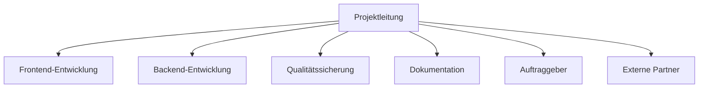

# Management Summary – YADRMS

## Projektziel und Kontext

YADRMS (Yet Another Discord Remote Management Software) ist ein modulares Remote-Management-System, das Discord als Kommunikationskanal nutzt. Ziel des Projekts war es, eine flexible, sichere und einfach erweiterbare Lösung für die Fernsteuerung und Überwachung von Systemen zu schaffen – insbesondere für den Einsatz in kontrollierten, nicht-produktiven Umgebungen.

---

## Hauptziele und Ergebnisse

- Entwicklung einer modernen, webbasierten Benutzeroberfläche (Next.js) zur Konfiguration und Steuerung von Remote-Clients
- Automatisierte Generierung individueller Python-Clients mit modularen Funktionen
- Integration von Discord als zentrale Steuer- und Monitoring-Plattform
- Bereitstellung von Beispielmodulen (z. B. Screenshot, Clipboard, Ghostwriting, Wallpaper, BSOD)
- Implementierung eines flexiblen API- und Modulsystems für zukünftige Erweiterungen
- Erstellung umfassender Projektdokumentation (Nutzwertanalyse, Detailkonzept, PSP, Kommunikationskonzept)

---

## Schlüsselerkenntnisse und Ergebnisse

- Die Nutzung von Discord als C2-Kanal ermöglicht eine intuitive und sichere Steuerung, ohne eigene Server-Infrastruktur betreiben zu müssen.
- Die modulare Architektur erlaubt eine schnelle Erweiterung und Anpassung an neue Anforderungen.
- Die klare Trennung von Frontend, Backend und Modulen vereinfacht Wartung und Weiterentwicklung.
- Die Projektmethodik (Kanban, regelmäßige Reviews, klare Arbeitspakete) hat zu hoher Transparenz und Effizienz geführt.

---

## Herausforderungen und Lösungen

- **Schnittstellenintegration:** Die Abstimmung zwischen Frontend, Backend und Discord-API erforderte intensive Tests und frühe Prototypen.
- **Sicherheit:** Die sichere Handhabung von Tokens und Zugriffsrechten wurde durch klare Guidelines und isolierte Settings gewährleistet.
- **Modularität:** Die Entwicklung eines flexiblen Modulsystems war komplex, wurde aber durch einheitliche Schnittstellen und klare Dokumentation gelöst.
- **Ressourcenplanung:** Engpässe im Team wurden durch Priorisierung und flexible Aufgabenverteilung kompensiert.

---

## Zukünftige Perspektiven

- **Funktionserweiterung:** Entwicklung weiterer Module (z. B. Dateiübertragung, Remote-Desktop, erweiterte Monitoring-Features)
- **Plattformunterstützung:** Ausbau auf weitere Programmiersprachen und Betriebssysteme
- **Sicherheit:** Implementierung zusätzlicher Authentifizierungs- und Verschlüsselungsmechanismen
- **Automatisierung:** Integration von CI/CD für schnellere Releases und automatisierte Tests
- **Community & Open Source:** Öffnung für externe Beiträge und Ausbau der Dokumentation

---

# 6-3-5 Methode

| Team-Mitglieder   | Idee 1                                                 | Idee 2                                               | Idee 3                                                 |
| ----------------- | ------------------------------------------------------ | ---------------------------------------------------- | ------------------------------------------------------ |
| **Isaac Lins**    | SmartPlant – Eine App zur automatischen Pflanzenpflege | Automatisierte Remote-Management-System für Geräte   | StudyBuddy – Lernplattform für Studierende             |
| **Kenta Waibel**  | Sensorintegration für Feuchtigkeits- und Lichtmessung  | Easy management, no coding-knowledge für gebrauch    | KI-gestützte Lernempfehlungen für Studierende          |
| **Oliver Zenger** | Push-Benachrichtigungen bei Giessbedarf                | Discord als Kommunikationskanal für Remote-Steuerung | Integration von Lernstatistiken und Fortschrittsbalken |
| **Joel Furter**   | Community-Feature zum Pflanzentausch                   | Modulare Architektur für einfache Erweiterbarkeit    | Peer-to-Peer-Lernräume mit Videochat                   |
| **Nino Sigrist**  | Automatische Pflanzenidentifikation per Foto           | Webbasierte UI für Konfiguration und Monitoring      | Mobile App für schnellen Zugriff auf Lerninhalte       |
| **Eris Jakupi**   | Wetterdaten-Integration für optimale Pflegehinweise    | Automatische Python-Client-Generierung               | Gamification: Badges für Lernziele und Challenges      |

# Projektidee – Beschreibung: YADRMS

## Ziele / Erwarteter Nutzen

Entwicklung und Dokumentation einer klaren, innovativen und umsetzbaren Projektidee für **YADRMS (Yet Another Discord Remote Management Software)**, die den Anforderungen der End-Dokumentation entspricht und einen echten Nutzen für Bildungszwecke stiftet.

## 1. Beschreibung des Grundproblems bzw. Bedarfs

In der modernen IT-Ausbildung und im Bereich der Cybersecurity-Bildung besteht ein wachsender Bedarf an praktischen, hands-on Lernerfahrungen. Traditionelle Lernansätze sind oft zu theoretisch und bieten wenig Gelegenheit, reale Systemarchitekturen und Technologie-Integrationen zu verstehen.

**Identifizierte Probleme:**

- Mangel an praktischen Demonstrationstools für moderne Softwarearchitekturen
- Komplexität beim Erlernen von Client-Server-Kommunikation und API-Integration
- Fehlende zugängliche Plattformen für das Experimentieren mit modularen Systemen
- Bedarf an sicheren, kontrollierten Umgebungen für Remote-Management-Konzepte

## 2. Zielgruppenanalyse: Wer profitiert vom Projekt?

### Primäre Zielgruppe:

- **Studierende der Informatik/IT**: Lernen moderne Webentwicklung und Backend-Integration
- **Cybersecurity-Lernende**: Verstehen von C2-Konzepten in kontrollierten Umgebungen
- **Dozenten und Ausbildner**: Praktisches Demonstrationstool für Systemarchitekturen

### Sekundäre Zielgruppe:

- **Hobbyentwickler**: Interesse an Discord-Bot-Entwicklung und modularen Systemen
- **IT-Professionals**: Prototyping und Experimentieren mit neuen Technologien

## 3. Skizzierung der Kernidee und des geplanten Lieferobjekts

### Kernidee

YADRMS ist ein modulares Fernwartungs- und Verwaltungssystem, das Discord als Kommunikationskanal nutzt. Das System ermöglicht es Benutzern, über eine intuitive Weboberfläche einen benutzerdefinierten Python-Client zu konfigurieren und zu generieren.
Dieser Client verbindet sich nach der Ausführung auf einem Zielsystem mit einem Discord-Server und wartet auf Befehle, die über einen Chat-Kanal gesendet werden.

### Geplantes Lieferobjekt

Ein vollständiges, funktionsfähiges System bestehend aus:

1. **Frontend (Next.js/TypeScript)**:

   - Moderne, reaktive Weboberfläche (`BuilderUI`)
   - Konfigurations-Interface für Discord-Bot-Einstellungen
   - Modulauswahl und -konfiguration
   - Echtzeit-Testing und Logging-Dashboard

2. **Backend (Python)**:

   - Dynamischer Client-Generator
   - Modulares Plugin-System
   - API-Endpunkte für Frontend-Kommunikation
   - Templating-Engine für Python-Code-Generierung

3. **Generierter Client**:
   - Anpassbarer Python-Bot
   - Discord-Integration
   - Modulare Funktionalitäten (Screenshots, Systeminformationen, etc.)

## 4. Nutzen und Relevanz der Idee

### Bildungsnutzen:

- **Praktische Anwendung**: Das YADRMS-Projekt bietet einen erheblichen Bildungsnutzen durch die direkte Umsetzung theoretischer Konzepte in die Praxis. Studierende können hier nicht nur theoretisches Wissen erwerben, sondern es unmittelbar in einem funktionsfähigen System anwenden.
- **Technologie-Integration**: Die Integration verschiedener Technologien ermöglicht ein tiefgreifendes Verständnis für moderne Web-Technologien und API-Design-Prinzipien.
- **Sichere Experimentierumgebung**: Besonders wertvoll ist die Bereitstellung einer sicheren Experimentierumgebung, die es ermöglicht, komplexe Konzepte in einer kontrollierten Lernumgebung zu erproben, ohne dabei Produktionsrisiken einzugehen.
- **Lern- und Bildungswert**: Das Projekt dient als praktisches Beispiel für moderne Softwareentwicklung.
- **Portfolio-Artefakt**: Die Dokumentation und der Code dienen als Nachweis für erworbener Kompetenzen.
- **Modulare Basis**: Die entwickelte Architektur kann als Grundlage für zukünftige Projekte oder Erweiterungen dienen.
- **Modulare Entwicklung**: Durch die modulare Entwicklung lernen Teilnehmer die Grundlagen von Plugin-Architekturen und die Bedeutung von Erweiterbarkeit in Softwareprojekten kennen.

### Technische Relevanz:

- **Moderne Architektur**: Das YADRMS-Projekt demonstriert eine moderne Softwarearchitektur durch die klare Trennung von Frontend und Backend. Diese Architektur ermöglicht es Entwicklern, die Prinzipien der Separation of Concerns und der modularen Entwicklung in der Praxis zu erleben und zu verstehen.
- **API-First-Ansatz**: Durch die Implementierung von RESTful-Services und asynchroner Kommunikation zeigt das Projekt die Bedeutung eines API-First-Designs auf. Entwickler lernen hier, wie moderne Webanwendungen durch gut definierte Schnittstellen kommunizieren und wie diese für Skalierbarkeit und Wartbarkeit sorgen.
- **Dynamische Code-Generierung**: Die Template-basierte Programmierung zur Generierung von Python-Clients demonstriert fortgeschrittene Konzepte der Metaprogrammierung. Diese Technik zeigt, wie Code automatisiert erstellt werden kann und welche Möglichkeiten sich daraus für die Entwicklung von Konfigurationstools ergeben.
- **Discord-Integration**: Die Nutzung moderner Chat-APIs für innovative Anwendungen zeigt, wie externe Dienste in eigene Systeme integriert werden können. Diese Integration demonstriert praktische Anwendungen von Webhook-Technologien und Event-driven Architecture in realen Szenarien.

### Effizienzsteigerung:

- **Schnelle Prototyperstellung**: Modulare Zusammenstellung von Funktionalitäten ermöglicht schnelle Prototypen.
- **Wiederverwendbarkeit**: Plugin-System ermöglicht einfache Erweiterungen.
- **Benutzerfreundlichkeit**: Intuitive Weboberfläche reduziert Einarbeitungszeit.

## 5. Abgrenzung: Was gehört nicht zum Projekt?

### Explizit ausgeschlossen:

- **Produktive Nutzung**: System ist ausschließlich für Bildungszwecke konzipiert
- **Sicherheitsfeatures**: Keine Verschlüsselung oder Authentifizierung (bewusste Vereinfachung)
- **Enterprise-Features**: Keine Benutzerverwaltung, Audit-Logs oder Compliance-Features
- **Mobile Apps**: Fokus liegt auf Web-Interface, keine nativen Apps
- **Alternative Plattformen**: Discord ist die einzige unterstützte Kommunikationsplattform

### Bewusste Limitierungen:

- **Kontrollierten Umgebungen**: Nutzung nur auf eigenen/autorisierten Systemen
- **Bildungskontext**: Kein kommerzieller oder produktiver Einsatz
- **Demonstrationszwecke**: Fokus auf Lerneffekt, nicht auf Performance oder Skalierbarkeit

## 6. Erste Gedanken zu Umsetzbarkeit, Tools, Technologien oder Methoden

### Frontend-Technologien:

- **Next.js <14**: React-Framework für moderne Webentwicklung
- **TypeScript**: Typsicherheit und bessere Entwicklererfahrung
- **ShadCN/UI**: Konsistente, moderne UI-Komponenten
- **Tailwind CSS**: Utility-first CSS-Framework

### Backend-Technologien:

- **Python 3.9+**: Flexibilität für dynamische Code-Generierung
- **Flask/FastAPI**: Leichtgewichtige REST-API-Frameworks
- **Jinja2**: Template-Engine für Python-Code-Generierung
- **Discord.py**: Discord-API-Integration

### Entwicklungsmethodik:

- **Modulare Architektur**: Plugin-basiertes System für einfache Erweiterbarkeit
- **API-First-Design**: Klare Trennung zwischen Frontend und Backend
- **Test-driven Development**: Automatisierte Tests für kritische Komponenten
- **Agile Entwicklung**: Iterative Entwicklung mit regelmäßigen Prototypen

### Umsetzungsrisiken und Mitigation:

- **Discord-API-Limitierungen**: Dokumentation studieren, Rate-Limiting implementieren
- **Security-Awareness**: Klare Dokumentation der Bildungszwecke und Risiken
- **Komplexität der Code-Generierung**: Schrittweise Entwicklung, umfassende Tests
- **Cross-Platform-Kompatibilität**: Testing auf verschiedenen Betriebssystemen

# HERO JOURNEY: [TODO: put in PDF]

# Projektantrag: [TODO: put in PDF]

# Projektorganisation – YADRMS

## Ziel
Die endgültige Organisation des Projekts umfasst die Strukturierung des Teams, Zuweisung von Aufgaben und Verantwortlichkeiten sowie die Festlegung von Prozessen zur erfolgreichen Durchführung des Projekts.

---

## 1. Projektteam & Rollenverteilung

### Organigramm (Mermaid)

### Rollen, Verantwortlichkeiten & Zuordnung

| Rolle                | Name/Person         | Verantwortlichkeiten                        |
|----------------------|---------------------|---------------------------------------------|
| Projektleitung       | Isaac Lins      | Steuerung, Zeitplan, Eskalation, Reporting  |
| Frontend-Entwicklung | YADRMS-TEAM       | UI/UX, BuilderUI, API-Anbindung             |
| Backend-Entwicklung  |  YADRMS-TEAM         | Python-Builder, Module, Schnittstellen      |
| Qualitätssicherung   |  YADRMS-TEAM           | Tests, Reviews, Abnahme                     |
| Dokumentation        |  YADRMS-TEAM      | How-To, Anwenderdoku, Protokolle            |
| Auftraggeber         | Jay Nagel          | Anforderungen, Feedback, Abnahme            |
| Externe Partner      | (Discord)     | Beratung, Support                           |

---

## 2. Finaler Projektstrukturplan (PSP) & Arbeitspakete

- Im Dokument [Projektstruktur und Arbeitspakete]() finden sie die finale Projektstruktur und Arbeitspakete
- Arbeitspakete wurden priorisiert und Abhängigkeiten final geklärt
- Kritische Pfade: UI/UX → BuilderUI → API-Anbindung → Integration → Systemtests

**Prioritäten:**
1. Grundfunktionalität (BuilderUI, Python-Builder, API)
2. Modulerweiterung & Testing
3. Dokumentation & Abschluss

**Abhängigkeiten:**
- API-Anbindung benötigt fertige Backend-Schnittstellen
- Systemtests erst nach Integration möglich

---

## 3. Projektmethoden & Tools

| Bereich           | Tool/Methodik         | Beschreibung                        |
|-------------------|----------------------|--------------------------------------|
| Zusammenarbeit    | Microsoft Teams, Discord       | Teamkommunikation, schnelle Abstimmung|
| Aufgabenmanagement| GitHub Issues/Boards | Aufgaben, Status, Backlog, Review    |
| Dokumentation     | Notion, Markdown     | Projektdoku, Protokolle, How-To      |
| Meetings          | Microsoft Teams      | Regelmeetings, Screen-Sharing        |
| Projektmanagement | Kanban (GitHub)      | Sprintplanung, Aufgabenverfolgung     |
| Zeitplanung       | Gantt-Diagramm       | Zeitliche Planung, Meilensteine      |

- **Methodik:** Kanban (iterativ, flexibel, mit Backlog und Sprints)
- **Deadlines:** Werden im Gantt-Chart und GitHub Board gepflegt

---

## 4. Kommunikationswege & Meetingstruktur

| Kommunikationsweg     | Zweck/Inhalt                | Frequenz           | Verantwortlich         |
|----------------------|-----------------------------|--------------------|------------------------|
| Weekly Meeting       | Status, Planung             | 1× pro Woche       | Projektleitung         |
| Statusbericht        | Fortschritt, Blocker        | Alle 2 Wochen      | Teammitglieder         |
| Ad-hoc-Meeting       | Eskalation, Freigabe        | Nach Bedarf        | Projektleitung         |
| GitHub Issues/Boards | Aufgaben, Status, Review    | Laufend            | Entwickler, Tester     |

- **Eskalationsweg:** Blocker werden im Weekly oder per E-Mail an die Projektleitung gemeldet. Kritische Themen werden kurzfristig in Ad-hoc-Meetings behandelt.

---

## 5. Ressourcenplanung

| Ressource                | Verfügbarkeit / Planung         |
|-------------------------|----------------------------------|
| Entwickler (FE/BE)      | 2× Vollzeit                      |
| QA                      | 1× Vollzeit                      |
| Dokumentation           | 1× Vollzeit                      |
| Technische Infrastruktur| GitHub, Cloud, Testsysteme       |
| Budget                  | Nach Aufwand  |

- Ressourcen werden im Projektboard und Gantt-Chart eingeplant
- Verfügbarkeit wird regelmäßig im Weekly überprüft

---

## 6. Risikomanagement & Controlling

### Risiken & Maßnahmen
| Risiko                        | Eintrittswahrscheinlichkeit | Auswirkung | Gegenmaßnahme                        |
|-------------------------------|-----------------------------|------------|--------------------------------------|
| Verzögerung bei Schnittstellen| Mittel                      | Hoch       | Frühe Abstimmung, API-Tests          |
| Personalausfall               | Niedrig                     | Mittel     | Vertretungsregel, Wissensdoku        |
| Technische Probleme           | Mittel                      | Hoch       | Prototyping, regelmäßige Tests       |
| Unklare Anforderungen         | Mittel                      | Hoch       | Regelmäßige Reviews, Abnahme         |

### Controlling
- Statusberichte alle 2 Wochen
- Review der Arbeitspakete im Weekly
- Fortschrittstracking via GitHub Board und Gantt-Chart
- Anpassung der Planung bei Abweichungen

---
**Legende:**
- YADRMS-TEAM = Isaac Lins, Oliver Zenger, Joel Furter, Kenta Waibel

---
**Mit dieser finalen Projektorganisation sind alle Rollen, Verantwortlichkeiten, Methoden und Prozesse klar geregelt. Sie bildet die Grundlage für eine erfolgreiche und transparente Projektdurchführung.** 

# Projektstruktur – YADRMS

## Ziel
Die Projektstruktur zerlegt das Gesamtprojekt in übersichtliche Teilaufgaben und Arbeitspakete. Dies ermöglicht eine klare Aufgabenverteilung, erleichtert das Controlling und bildet die Grundlage für Zeit- und Ressourcenplanung.

---

## 1. Projektstrukturplan (PSP)

### Hierarchische Gliederung

1. Projektstart & Planung
    1.1 Anforderungsanalyse
    1.2 Grob- & Detailkonzept
    1.3 Projektstruktur & Arbeitspakete
2. Entwicklung
    2.1 Frontend-Entwicklung
        2.1.1 UI/UX Design
        2.1.2 Implementierung BuilderUI
        2.1.3 API-Anbindung
        2.1.4 Testing & Review
    2.2 Backend-Entwicklung
        2.2.1 Python-Builder
        2.2.2 Modulentwicklung
        2.2.3 Schnittstellen/API
        2.2.4 Testing & Review
3. Integration & Test
    3.1 Integration Frontend/Backend
    3.2 Systemtests
    3.3 User Acceptance Test
4. Dokumentation & Abschluss
    4.1 Nutzwertanalyse
    4.2 Detailkonzept
    4.3 How-To & Anwenderdoku
    4.4 Projektabschluss & Übergabe

### Visuelle Darstellung (Mermaid Baumstruktur)

```mermaid
graph TD
    A[Projektstart & Planung]
    B[Entwicklung]
    C[Integration & Test]
    D[Dokumentation & Abschluss]

    A1(Anforderungsanalyse)
    A2(Grob- & Detailkonzept)
    A3(Projektstruktur & APs)
    B1(Frontend-Entwicklung)
    B2(Backend-Entwicklung)
    B1a(UI/UX Design)
    B1b(BuilderUI)
    B1c(API-Anbindung)
    B1d(Testing & Review)
    B2a(Python-Builder)
    B2b(Modulentwicklung)
    B2c(Schnittstellen/API)
    B2d(Testing & Review)
    C1(Integration Frontend/Backend)
    C2(Systemtests)
    C3(User Acceptance Test)
    D1(Nutzwertanalyse)
    D2(Detailkonzept)
    D3(How-To & Anwenderdoku)
    D4(Projektabschluss & Übergabe)

    A --> A1
    A --> A2
    A --> A3
    B --> B1
    B --> B2
    B1 --> B1a
    B1 --> B1b
    B1 --> B1c
    B1 --> B1d
    B2 --> B2a
    B2 --> B2b
    B2 --> B2c
    B2 --> B2d
    C --> C1
    C --> C2
    C --> C3
    D --> D1
    D --> D2
    D --> D3
    D --> D4
```

---

**Dieser Projektstrukturplan bildet die Grundlage für die weitere Zeit- und Ressourcenplanung wie in unserem Gantt-Chart und das Projektcontrolling.** 

# Projektkommunikationskonzept – YADRMS

## Ziel
Ein strukturiertes Kommunikationskonzept stellt sicher, dass alle Projektbeteiligten zur richtigen Zeit die richtigen Informationen erhalten. Es regelt, wer mit wem worüber, wie oft, auf welchem Weg kommuniziert.

---

## 1. Zielgruppen und Beteiligte

| Rolle                | Beteiligte / Zielgruppe         | Verantwortlichkeiten                |
|----------------------|---------------------------------|-------------------------------------|
| Projektleitung       | Projektmanager, Product Owner   | Steuerung, Koordination, Reporting  |
| Entwicklung          | Frontend-/Backend-Entwickler    | Umsetzung, Testing, Dokumentation   |
| Tester               | QA, Endnutzer                   | Testdurchführung, Feedback          |
| Auftraggeber         | Kunde, Stakeholder              | Anforderungen, Abnahme, Feedback    |
| Externe Partner      | Dienstleister, Berater          | Beratung, Zulieferung, Support      |

---

## 2. Kommunikationsziele

- Transparenz und Nachvollziehbarkeit im Projektverlauf
- Informationssicherheit und Vermeidung von Missverständnissen
- Dokumentation von Entscheidungen und Fortschritten
- Sicherstellung, dass alle Beteiligten stets informiert sind

---

## 3. Kommunikationsmittel & -kanäle

| Medium                | Zweck / Inhalt                  | Intern/Extern | Synchron/Asynchron |
|-----------------------|---------------------------------|--------------|--------------------|
| Discord         | Teamkommunikation, schnelle Abstimmung | Intern       | Synchron/Async     |
| Microsoft Teams       | Meetings, Screen-Sharing        | Intern        | Synchron           |
| Persönliche Meetings  | Kickoff, Review, Retrospektive  | Intern        | Synchron           |
| Notion                | Projektdokumentation, Wissensbasis | Intern    | Asynchron          |
| GitHub Issues/Boards  | Aufgaben, Status, Bugtracking   | Intern        | Asynchron          |
| E-Mail                | Offizielle Kommunikation, Protokolle | Extern   | Asynchron          |
| Präsentationen        | Status, Ergebnisse, Meilensteine| Extern        | Synchron           |
| Projektberichte       | Fortschritt, Status             | Extern        | Asynchron          |
| Projekt-Website       | Öffentliches Update, Info        | Extern        | Asynchron          |

---

## 4. Formen der Kommunikation

- **Regelkommunikation:**
  - Wöchentliche Teammeetings (Status, Planung)
  - Wöchentliche Statusberichte
- **Anlassbezogene Kommunikation:**
  - Eskalationen, Freigaben, Statusänderungen, Blocker
  - Ad-hoc-Meetings bei Bedarf
- **Dokumentation:**
  - Protokolle von Meetings und Entscheidungen
  - Aufgabenverfolgung und Status in GitHub Issues/Boards
  - Fortschrittsdokumentation in Notion

---

## 5. Frequenz und Verantwortlichkeit

| Medium           | Häufigkeit         | Verantwortlich         |
|------------------|--------------------|------------------------|
| Weekly Meeting   | 1× pro Woche       | Projektleitung         |
| Statusbericht    | 1× pro Woche       | Teammitglieder         |
| Protokolle       | Nach Bedarf        | Zuständige Person      |
| E-Mail           | Nach Bedarf        | Projektleitung, Team   |
| GitHub Issues    | Laufend            | Entwickler, Tester     |

---

## 6. Kommunikationsregeln

- Freundlich, verbindlich und zielorientiert kommunizieren
- Deadlines klar kommunizieren und bestätigen
- Entscheidungen und wichtige Absprachen schriftlich dokumentieren
- Status und Blocker offen ansprechen
- Vertrauliche Informationen nur über sichere Kanäle teilen
- Feedback konstruktiv und zeitnah geben

---

**Dieses Kommunikationskonzept ist Bestandteil der Projektdokumentation und sichert eine reibungslose Zusammenarbeit, klare Zuständigkeiten und transparente Abläufe im Projekt YADRMS.** 