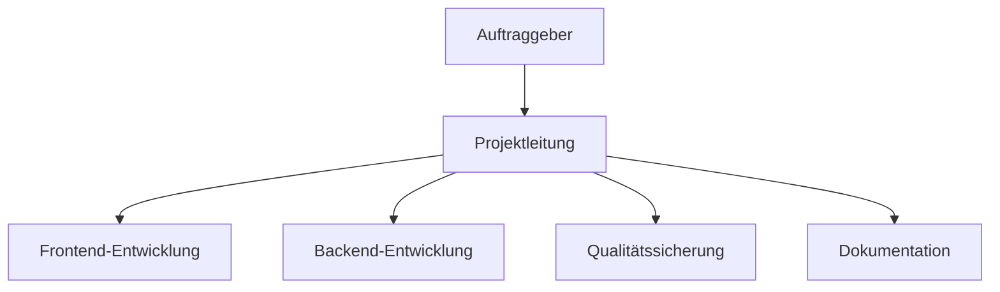

# YADRMS - Yet Another Discord Remote Management Software

## 1. Management Summary

YADRMS (Yet Another Discord Remote Management Software) ist ein modulares System für die Fernsteuerung von Computern. Es nutzt Discord als Kommunikationsweg. Das Ziel war es, eine flexible und einfach erweiterbare Lösung zu entwickeln. Das System soll vor allem für Bildung und Tests verwendet werden, nicht für den produktiven Einsatz.

Das Projekt umfasste die Entwicklung einer modernen Website zur Konfiguration und Steuerung von Remote-Clients. Das System kann automatisch individuelle Python-Clients erstellen. Diese Clients haben verschiedene Module, die je nach Bedarf ausgewählt werden können.

Discord wird als zentrale Steuer- und Überwachungsplattform verwendet. Das bietet eine einfache Bedienung ohne eigene Server-Infrastruktur. Das System wurde erfolgreich entwickelt und getestet.

Das Projekt wird durch eine umfassende Dokumentation ergänzt. Diese hilft bei der Wartung und dient als Referenz für zukünftige Entwicklungen.
Discord als Command-and-Control-Kanal hat sich als innovative Lösung bewährt. Es reduziert sowohl die Komplexität als auch die Kosten erheblich. Die modulare Architektur war ein wichtiger Erfolgsfaktor, weil sie schnelle Erweiterungen ermöglicht, ohne bestehende Funktionen zu stören.
Besonders wertvoll war die klare Trennung von Frontend, Backend und Modulen. Das ermöglichte es, verschiedene Systemteile parallel zu entwickeln. Die gewählte Projektmethodik mit Kanban-Board, regelmässigen Reviews und klaren Arbeitspaketen führte zu hoher Transparenz und effizienter Ressourcennutzung.

Eine der grössten Herausforderungen war die Integration zwischen Frontend, Backend und der Discord-API. Die Abstimmung dieser Komponenten brauchte intensive Testphasen und frühe Prototypen, um Probleme rechtzeitig zu finden. Durch iterative Entwicklung und kontinuierliche Integration konnten diese Hürden erfolgreich überwunden werden.

## 2. Ideenfindung mit 6-3-5 Methode

Für die Ideenfindung beim YADRMS-Projekt haben wir die 6-3-5 Methode verwendet. Dabei entwickeln sechs Teammitglieder jeweils drei Ideen und bauen diese in einem strukturierten Prozess weiter aus. Diese Methode hilft dabei, verschiedene Lösungsansätze systematisch zu sammeln und zu bewerten.

### 2.1 Die entwickelten Projektideen

Unsere Schülerkameraden hatten gemeinsam Ideen gesammelt. Dabei waren Isaac Lins (Projektleitung), Kenta Waibel, Oliver Zenger, Joel Furter, Nino Sigrist und Eris Jakupi beteiligt. Es entstanden viele verschiedene und innovative Projektideen.

| Team-Mitglieder   | Idee 1                                                 | Idee 2                                               | Idee 3                                                 |
| ----------------- | ------------------------------------------------------ | ---------------------------------------------------- | ------------------------------------------------------ |
| **Isaac Lins**    | SmartPlant – Eine App zur automatischen Pflanzenpflege | Automatisierte Remote-Management-System für Geräte   | StudyBuddy – Lernplattform für Studierende             |
| **Kenta Waibel**  | Sensorintegration für Feuchtigkeits- und Lichtmessung  | Easy management, no coding-knowledge für gebrauch    | KI-gestützte Lernempfehlungen für Studierende          |
| **Oliver Zenger** | Push-Benachrichtigungen bei Giessbedarf                | Discord als Kommunikationskanal für Remote-Steuerung | Integration von Lernstatistiken und Fortschrittsbalken |
| **Joel Furter**   | Community-Feature zum Pflanzentausch                   | Modulare Architektur für einfache Erweiterbarkeit    | Peer-to-Peer-Lernräume mit Videochat                   |
| **Nino Sigrist**  | Automatische Pflanzenidentifikation per Foto           | Webbasierte UI für Konfiguration und Monitoring      | Mobile App für schnellen Zugriff auf Lerninhalte       |
| **Eris Jakupi**   | Wetterdaten-Integration für optimale Pflegehinweise    | Automatische Python-Client-Generierung               | Gamification: Badges für Lernziele und Challenges      |

**Erste Ideenrunde - Grundkonzepte:**
Isaac Lins schlug SmartPlant vor - eine App zur automatischen Pflanzenpflege mit Sensoren und automatischer Bewässerung. Parallel dazu entwickelte er die Idee eines automatisierten Remote-Management-Systems für Geräte. Das wurde später zum Kern des YADRMS-Projekts. Als dritte Alternative schlug er StudyBuddy vor, eine Lernplattform für Studierende.

**Technische Erweiterungen:**
Kenta Waibel erweiterte die SmartPlant-Idee um Sensoren für Feuchtigkeit und Licht. Für das Remote-Management-System betonte er, dass es einfach zu bedienen sein sollte, ohne Programmierkenntnisse. Bei der StudyBuddy-Plattform konzentrierte er sich auf KI-gestützte Lernempfehlungen.

**Benutzerfreundlichkeit und Interaktion:**
Oliver Zenger dachte an die Benutzer und schlug Push-Benachrichtigungen bei Giessbedarf für SmartPlant vor. Für das Remote-Management-System hatte er eine innovative Idee: Discord als Kommunikationsweg zu nutzen. Diese Entscheidung wurde später sehr wichtig für das finale Projekt. Bei StudyBuddy konzentrierte er sich auf Lernstatistiken und Fortschrittsbalken.

**Community und Erweiterbarkeit:**
Joel Furter dachte an Community-Features und schlug für SmartPlant eine Plattform zum Pflanzentausch vor. Seine Überlegungen zur modularen Architektur für das Remote-Management-System wurden später zur Grundlage der Systemarchitektur. Für StudyBuddy entwickelte er das Konzept von Peer-to-Peer-Lernräumen mit Videochat.

**Intelligente Funktionen:**
Nino Sigrist brachte fortgeschrittene Features ein, wie automatische Pflanzenidentifikation per Foto für SmartPlant. Für das Remote-Management-System schlug er eine webbasierte Benutzeroberfläche für Konfiguration und Monitoring vor. Bei StudyBuddy konzentrierte er sich auf eine mobile App für schnellen Zugriff auf Lerninhalte.

**Integration und Automatisierung:**
Eris Jakupi rundete die Ideensammlung mit Wetterdaten-Integration für SmartPlant ab. Seine Idee der automatischen Python-Client-Generierung wurde später zu einem wichtigen Feature des YADRMS-Systems. Für StudyBuddy entwickelte er Gamification-Konzepte mit Badges für Lernziele und Challenges.

### 2.2 Ideenbewertung und Projektauswahl

Nach dem Sammeln aller Ideen haben wir die drei Hauptkonzepte strukturiert bewertet. Das Remote-Management-System wurde ausgewählt, weil es technisch innovativ war, praktisch umsetzbar und einen hohen Lernwert für alle Beteiligten hatte. Die Integration von Discord als Kommunikationsweg und die modulare Architektur waren die entscheidenden Besonderheiten, die zur finalen Projektauswahl führten.

## 2.1 Projektidee

### 2.1.1 Ziele und erwarteter Nutzen

Die Entwicklung und Dokumentation einer klaren und umsetzbaren Projektidee für YADRMS steht im Zentrum dieses Vorhabens. Dabei liegt der Fokus auf einer praxisorientierten Lernumgebung, die theoretisches Wissen in greifbare Anwendungen umsetzt.

### 2.1.2 Beschreibung des Problems und Bedarfs

In der modernen IT-Ausbildung und im Bereich der Cybersecurity-Bildung fehlen praktische, hands-on Lernerfahrungen. Traditionelle Lernansätze sind oft zu theoretisch und bieten wenig Gelegenheit, echte Systemarchitekturen und Technologie-Integrationen zu verstehen.

Die identifizierten Probleme umfassen einen Mangel an praktischen Demonstrationstools für moderne Softwarearchitekturen. Ausserdem ist das Erlernen von Client-Server-Kommunikation und API-Integration komplex. Es fehlen zugängliche Plattformen für das Experimentieren mit modularen Systemen. Gleichzeitig besteht ein Bedarf an sicheren, kontrollierten Umgebungen für Remote-Management-Konzepte.

### 2.1.3 Zielgruppenanalyse

Studierende der Informatik und IT bilden die Hauptzielgruppe. Sie können durch das Projekt moderne Webentwicklung und Backend-Integration lernen. Cybersecurity-Lernende profitieren vom Verständnis von C2-Konzepten (Command & Control) in kontrollierten Umgebungen. Dozenten und Ausbildner erhalten ein praktisches Demonstrationstool für Systemarchitekturen.
Hobbyentwickler mit Interesse an Discord-Bot-Entwicklung und modularen Systemen sowie IT-Professionals, die Prototyping und Experimentieren mit neuen Technologien betreiben, ergänzen die Zielgruppe.

### 2.1.4 Kernidee und geplantes Ergebnis

**Kernidee:**
Wir wollten ein modulares System für die Fernwartung und Verwaltung, das Discord als Kommunikationsweg nutzt. Das System sollte es Benutzern ermöglichen, über eine einfache Weboberfläche einen benutzerdefinierten Python-Client zu konfigurieren und zu erstellen. Dieser Client verbindet sich nach der Ausführung auf einem Zielsystem mit einem Discord-Server und wartet auf Befehle, die über einen Chat-Kanal gesendet werden.

Als geplantes Ergebnis wollten wir ein Benutzerfreundliches, Intiuitives Webinterface, dass es den Nutzern ermöglicht, einen Gerät zu kontrollieren, ohne vorwissen haben zu müssen.

Wenn der Benutzer einen Befehl sendet, soll das System den Befehl an das Zielsystem weiterleiten und das Ergebnis zurückgeben.

### 2.1.5 Projektabgrenzung

**Was nicht Teil des Projekts ist:**
Das System ist ausschliesslich für Bildungszwecke gedacht und nicht für produktive Nutzung vorgesehen. Dies den Nutzern zu sagen ist sehr wichtig, da YADRMS sonst in böser Absicht benutzt werden könnte.

Für den Kommunikationskanal hätten wir eigenlich 2 Optionen:

- Einen C2 Server selbst Coden
- Einen Drittanbieter service benutzen und mit unserem API verbinden

Wir haben uns für die zweite Option entschieden, da wir uns nicht dafür interessieren, einen eigenen C2 Server zu entwickeln. Wir wollten einen Service, der uns die Kommunikation mit dem Zielsystem übernimmt.

### 2.1.6 Umsetzungsplanung

Für die Umsetzung haben wir uns für die folgenden Technologien entschieden:

**Frontend:**
Next.js 14 wird als React-Framework für moderne Webentwicklung eingesetzt, ergänzt durch TypeScript für Typsicherheit und bessere Entwicklererfahrung. ShadCN/UI stellt konsistente, moderne UI-Komponenten bereit, während Tailwind CSS als Utility-first CSS-Framework dient.

**Backend:**
Python 3.9+ bietet die nötige Flexibilität für dynamische Code-Generierung. Flask oder FastAPI werden als leichtgewichtige REST-API-Frameworks eingesetzt. Jinja2 dient als Template-Engine für Python-Code-Generierung und Discord.py für Discord-API-Integration.

**Entwicklungsmethodik:**
Die modulare Architektur ermöglicht ein Plugin-basiertes System für einfache Erweiterbarkeit. Das API-First-Design gewährleistet klare Trennung zwischen Frontend und Backend.

Wichtig war Modularität, da wir später andere Tech-savvy Users die möglichkeit geben wollten, eigene Module zu erstellen.

### 2.1.7 Hero Journey

Wir haben uns inspiriert und ein Hero Journey erstellt.
Im Hero Journey haben wir eine mögliche Benutzerreise dargestellt.
Bei unserem Beispiel haben wir einen Benutzer, der mehrere Systeme verwaltet.
Leider hat er ein Problem. Ein kritisches Sicherheitsproblem wird bekannt - eine Schwachstelle in einer wichtigen Abhängigkeit, die sofort auf allen Servern gepatcht werden muss.

[!Hero Journey](2_2_hero-journey.pdf)

## 3. Grobkonzept und Projektantrag

### 3.1 Grobkonzept für YADRMS

Das Grobkonzept für YADRMS zeigt die grundlegende Architektur und den Ansatz des Systems. Es wird in einer visuellen Darstellung als morphologischer Kasten präsentiert.

[!Grobkonzept](3_1_grobkonzept.png)

Die wichtigsten Entscheidungen wurden systematisch getroffen. Die Weboberfläche bietet die beste Bedienbarkeit für verschiedene Nutzer. Discord als Kommunikationsweg ist einfach zu verwenden und weit verbreitet. Python wurde als Programmiersprache gewählt, weil es flexibel und gut für automatische Code-Erzeugung geeignet ist.

### 3.2 Projektantrag

[!Projektantrag](3_2_projektantrag.pdf)

Dieses Dokument enthält alle wichtigen Informationen für die Projektgenehmigung und -planung.
Beispielsweise wird erklärt, warum das Projekt für die Ausbildung wertvoll ist und welche Ressourcen und Zeitplan für die verschiedenen Projektphasen eingeplant sind.
Die Aufteilung der Arbeit zwischen den Teammitgliedern wird ebenfalls dargestellt.

## 4. Projektorganisation

Die Projektorganisation von YADRMS basiert auf klar definierten Rollen und Verantwortlichkeiten. Jedes Teammitglied hat spezifische Aufgaben und Bereiche, für die es verantwortlich ist.

**Projektleitung (Isaac Lins):**
Isaac Lins übernimmt die Projektleitung und ist für die Gesamtkoordination verantwortlich. Er plant die Termine, überwacht den Fortschritt und sorgt dafür, dass alle Teammitglieder ihre Aufgaben erfüllen können.

**Frontend-Entwicklung (Kenta Waibel):**
Kenta Waibel ist für die Entwicklung der Weboberfläche zuständig. Seine Aufgaben umfassen die Erstellung der Benutzeroberfläche, die Integration mit dem Backend und die Optimierung der Benutzererfahrung.

**Backend-Entwicklung (Oliver Zenger):**
Oliver Zenger entwickelt das Backend-System und die API-Schnittstellen. Er ist verantwortlich für die Serversoftware und die Verbindung zur Discord-API. Seine Arbeit bildet die Grundlage für alle anderen Systemkomponenten.

**Modulentwicklung (Joel Furter):**
Joel Furter konzentriert sich auf die Entwicklung der verschiedenen Module für das System. Er erstellt die Plugins und Funktionen, die später von den Clients verwendet werden. Dazu gehören Module für Screenshots, Systemsteuerung und andere Remote-Funktionen.

Schlussendlich haben wir eine Tabelle, indem alles übersichtlich dargestellt wird.

| Rolle                | Name/Person                 | Verantwortlichkeiten                   |
| -------------------- | --------------------------- | -------------------------------------- |
| Projektleitung       | Isaac Lins                  | Steuerung, Zeitplan, Reporting         |
| Frontend-Entwicklung | Kenta Waibel, Oliver Zenger | UI/UX, BuilderUI, API-Anbindung        |
| Backend-Entwicklung  | Joel Furter                 | Python-Builder, Module, Schnittstellen |
| Dokumentation        | YADRMS-TEAM (Alle)          | How-To, Anwenderdoku, Protokolle       |
| Auftraggeber         | Jay-Leo Nagel               | Anforderungen, Feedback, Abnahme       |

### 4.1 Kommunikationsstrukturen

Die Kommunikation im YADRMS-Projekt folgt klaren Strukturen und Regeln. Das stellt sicher, dass alle Informationen rechtzeitig und an die richtigen Personen weitergegeben werden.

**Interne Kommunikation:**
Die tägliche Kommunikation findet hauptsächlich über Discord statt. Das Team hat einen eigenen Server mit verschiedenen Kanälen für unterschiedliche Themen. Es gibt separate Kanäle für Entwicklung, Dokumentation, Fragen und allgemeine Diskussionen. Diese Struktur hilft dabei, Informationen zu organisieren und schnell zu finden.

**Regelmässige Meetings:**
Das Team führt wöchentliche Meetings durch, um den Fortschritt zu besprechen und Probleme zu lösen. Diese Meetings finden jeden Montag statt und dauern maximal eine Stunde. Alle Teammitglieder berichten über ihre Arbeit und diskutieren anstehende Aufgaben.

### 4.2 Arbeitsaufteilung und Koordination

Die Arbeitsaufteilung im YADRMS-Projekt ist klar strukturiert. Jedes Teammitglied hat seine Hauptverantwortlichkeit, aber es gibt auch Überschneidungen und Zusammenarbeit zwischen den Bereichen.

**Hauptverantwortlichkeiten:**
Jeder Entwickler ist für seinen Bereich hauptverantwortlich. Das bedeutet, dass er die Entscheidungen für seinen Bereich trifft und die Qualität seiner Arbeit verantwortet. Gleichzeitig ist er aber auch verpflichtet, die anderen Teammitglieder zu unterstützen, wenn sie Hilfe brauchen.

**Zusammenarbeit:**
Die verschiedenen Bereiche müssen eng zusammenarbeiten. Der Frontend-Entwickler muss zum Beispiel mit dem Backend-Entwickler abstimmen, um die Schnittstellen zu definieren.

### 4.3 Ressourcenmanagement

Um eine effiziente Projektabwicklung zu gewährleisten, wird die verfügbare Zeit realistisch geplant und auf die verschiedenen Aufgaben verteilt. Das Team verwendet ein Kanban-Board, um den Fortschritt zu verfolgen und Engpässe zu identifizieren. Die Arbeitsbelastung wird gleichmässig auf alle Teammitglieder verteilt, wobei die individuellen Stärken und Interessen berücksichtigt werden. Wenn jemand überlastet ist, wird die Arbeit umverteilt oder zusätzliche Unterstützung organisiert.

Alle benötigten Tools und Technologien werden zu Beginn des Projekts identifiziert und organisiert. Das Team nutzt kostenlose und Open-Source-Tools, wo immer möglich. Wenn kostenpflichtige Tools benötigt werden, haben die Pech.

Potenzielle Risiken werden regelmässig besprochen und bewertet. Für die wichtigsten Risiken werden Notfallpläne erstellt. Das Team führt regelmässige Risikoanalysen durch und passt die Pläne bei Bedarf an.

## 4.1 Projektstruktur

Die Projektstruktur von YADRMS ist hierarchisch aufgebaut und in verschiedene Ebenen unterteilt. Jede Ebene hat spezifische Aufgaben und Verantwortlichkeiten. Diese Struktur hilft dabei, das Projekt übersichtlich zu organisieren und die Zusammenarbeit zwischen den Teammitgliedern zu erleichtern.

### 4.1.1 Hauptebenen der Struktur

Wir haben uns so Organisiert, dass wir die beste Struktur für das Projekt gefunden haben.
Die Struktur ist folgendermassen aufgebaut:

| Ebene | Bezeichnung       |
| ----- | ----------------- |
| 1     | Projektleitung    |
| 2     | Funktionsbereiche |
| 3     | Einzelaufgaben    |

**Ebene 1: Projektleitung**
Die oberste Ebene wird von der Projektleitung geführt. Diese plant die Termine, überwacht den Fortschritt und sorgt für die Kommunikation zwischen allen Beteiligten.

**Ebene 2: Funktionsbereiche**
Die zweite Ebene gliedert sich in verschiedene Funktionsbereiche. Es gibt separate Bereiche für Frontend-Entwicklung, Backend-Entwicklung, Modulentwicklung, Qualitätssicherung und Dokumentation. Jeder Bereich hat einen Verantwortlichen und klar definierte Aufgaben.

**Ebene 3: Einzelaufgaben**
Die dritte Ebene umfasst die konkreten Einzelaufgaben. Diese werden aus den grösseren Arbeitspaketen abgeleitet und können von einzelnen Personen bearbeitet werden. Jede Aufgabe hat eine klare Beschreibung und einen Zeitrahmen.

## 4.2 Projektkommunikationskonzept

Das Kommunikationskonzept soll sicherstellen, dass alle Beteiligten immer gut informiert sind. Es regelt, wie Informationen zwischen den Teammitgliedern, der Projektleitung und externen Partnern ausgetauscht werden. Ziel ist es, Missverständnisse zu vermeiden und eine effiziente Zusammenarbeit zu ermöglichen.

### 4.2.1 Kommunikationskanäle

Teams ist der Hauptkanal für die Kommunikation im Team. Hier werden schnelle Fragen gestellt, Probleme diskutiert und Entscheidungen getroffen. Dazu werden wir Teams für die wöchentlichen Teambesprechungen verwenden.
Alle Entwickler nutzen GitHub für die Zusammenarbeit am Code. Wir werden GitHub für die Dokumentation und die Protokollierung des Projekts verwenden.
Bei notfällen wird per privat Whatsapp genutzt.
Einen anderen Kanal wird für die Dokumentation und die Protokollierung des Projekts nicht gebraucht.

### 4.2.2 Meetings und Besprechungen

Jeden Freitag um 7:35 Uhr findet ein Teammeeting statt. Hier berichtet jeder über seine Arbeit der letzten Woche und plant die kommende Woche. Probleme werden besprochen und Entscheidungen getroffen.

Von jedem Meeting wird ein Protokoll erstellt. Das Protokoll enthält die wichtigsten Punkte, getroffene Entscheidungen und Aufgaben für die nächste Woche. Dieses Protokoll wird in Teams gespeichert.

### 4.2.3 Fortschrittsberichte

Alle zwei Wochen erstellt jeder Entwickler einen Fortschrittsbericht. Dieser enthält Informationen über die erledigten Aufgaben, aktuelle Probleme und geplante Aktivitäten. Die Berichte werden in Teams als Nachricht abgeschickt, damit wir ein wöchentlichen Überblick haben, von was gemacht wurde und was fehlt.

### 4.2.4 Konfliktmanagement

Konflikte sollen frühzeitig erkannt und angesprochen werden. Wenn es Meinungsverschiedenheiten gibt, sollten diese offen diskutiert werden. Das verhindert, dass sich kleine Probleme zu grösseren Konflikten entwickeln.

Bei Konflikten wird zuerst versucht, eine gemeinsame Lösung zu finden. Die Beteiligten diskutieren das Problem und suchen nach Kompromissen. Wenn keine Einigung möglich ist, wird der Konflikt an die Projektleitung eskaliert. Diese hört alle Beteiligten an und trifft eine Entscheidung.

## 5. Detailkonzept

Das Detailkonzept konkretisiert die im Grobkonzept definierte Lösung und beschreibt die technische, funktionale und organisatorische Umsetzung des Projekts im Detail. Es dient als verbindliche Grundlage für die Realisierung des Projekts und stellt sicher, dass alle Stakeholder ein gemeinsames Verständnis der geplanten Lösung haben.

### 5.0.1 Technische Architektur, Systemaufbau und Workflow

Das Frontend basiert auf Next.js 14 als modernem React-Framework. TypeScript wird durchgängig eingesetzt, um Typsicherheit zu gewährleisten und die Entwicklererfahrung durch intelligente Code-Vervollständigung und Fehlerprävention zu verbessern. ShadCN UI wird für die Bereitstellung moderner, barrierefreier UI-Komponenten eingesetzt.

Das Backend wird in Python 3.8+ entwickelt und nutzt die Flexibilität dieser Sprache für die dynamische Code-Generierung. Die modulare Architektur ermöglicht eine einfache Erweiterung um neue Funktionalitäten. Next.js API Routes werden für die REST-API-Implementierung verwendet, wodurch eine nahtlose Integration zwischen Frontend und Backend gewährleistet wird.

Die API-Schicht, implementiert durch Next.js API Routes, fungiert als Vermittler zwischen Frontend und Backend. Sie verarbeitet alle Anfragen, validiert Eingaben und koordiniert die Kommunikation mit dem Python Script Generator. Dieser Generator stellt das Herzstück des Systems dar und ist verantwortlich für die dynamische Erstellung massgeschneiderter Python-Clients basierend auf den Benutzerkonfigurationen.

Der generierte Python-Client wird als eigenständige Anwendung bereitgestellt, die auf dem Zielsystem ausgeführt wird. Nach der Aktivierung verbindet sich dieser Client mit dem konfigurierten Discord-Server und wartet auf Befehle, die über Chat-Kanäle gesendet werden. Diese Architektur ermöglicht eine vollständige Trennung von Konfiguration und Ausführung. Der User muss nicht Coden können, um die Funktionalität des Systems zu nutzen.

Die Anwendung verwendet JSON-Dateien für die Speicherung von Einstellungen, was eine einfache Konfiguration und Wartung ermöglicht. Diese dateibasierte Herangehensweise reduziert die Komplexität und macht externe Datenbanksysteme überflüssig
Die Discord-API bildet das Herzstück der Kommunikationsfunktionalität und ermöglicht die nahtlose Integration mit Discord-Servern. Node.js wird für die Ausführung der Anwendung verwendet, während Playwright für End-to-End-Tests und Jest sowie Mocha für Unit-Tests eingesetzt werden.

Die Bot-Konfigurationsfunktion ermöglicht es Benutzern, Discord-Token, Guild-IDs und gewünschte Module über eine intuitive Weboberfläche zu definieren. Das System speichert die Konfiguration in einer strukturierten JSON-Datei. Diese Konfiguration bildet die Grundlage für die anschliessende Client-Generierung.
Nach der Speicherung des JSONs kann der Benutzer die Kompilierung starten, welche beim Backend API-Aufrufe an den Python-Builder ausgelöst. Dieser liest die gespeicherten Einstellungen, wählt die entsprechenden Module aus und generiert einen vollständigen Python-Client. Der generierte Code wird im OUTPUT-Verzeichnis bereitgestellt und kann vom Benutzer heruntergeladen werden.

Nach dem Download startet der Benutzer das generierte Python-Skript auf dem Zielsystem. Der Bot verbindet sich automatisch mit Discord, erstellt, verwaltet den konfigurierten Channel und wartet auf eingehende Befehle. Die Kommunikation erfolgt über standardisierte Discord-Kommandos.
Die Remote-Steuerung erfolgt durch das Senden spezifischer Befehle im Discord-Channel. Ein Befehl wie ".screenshot" wird vom Bot empfangen, das entsprechende Modul ausgeführt und das Ergebnis als Nachricht oder Datei im Channel gepostet. Diese intuitive Bedienung ermöglicht eine einfache Fernsteuerung ohne technische Vorkenntnisse. Unterstützte Module umfassen Screenshots, Blue Screen Of Death, Clipboard-Operationen, Systeminformationen und einen vollen Bash shell auf dem Zielsystem.

Das System unterstützt die einfache Erweiterung um neue Module. Entwickler können neue Python-Module im entsprechenden Verzeichnis ablegen, und diese erscheinen automatisch in der Benutzeroberfläche. Diese Flexibilität ermöglicht eine kontinuierliche Weiterentwicklung und Anpassung an neue Anforderungen.

## 5.1 Nutzwertanalyse

Wir haben uns entschieden, eine Nutzwertanalyse durchzuführen, um überhaupt zu sehen, ob es sich lohnt, unsere Lösung zu entwickeln.
Unser Gedankengang war es, uns zu fragen, wer unsere Lösung nutzen würde, und warum sie unsere Lösung nutzen würden.

### 5.1.1 Kriterienauswahl & Gewichtung

Wir haben uns entschieden, die folgenden Kriterien zu berücksichtigen:

- Benutzerfreundlichkeit
- Entwicklungsaufwand
- Skalierbarkeit
- Kosten

Wenn wir die Kriterien in Prozent darstellen, erhalten wir folgende Gewichtung:

| Kriterium              | Gewichtung (%) |
| ---------------------- | :------------: |
| Benutzerfreundlichkeit |       60       |
| Entwicklungsaufwand    |       10       |
| Skalierbarkeit         |       20       |
| Kosten                 |       10       |

Dabei ist es uns sehr wichtig, dass die Lösung benutzerfreundlich ist und wir uns nicht auf die Entwickler selbst konzentrieren müssen. Wir wollen, dass der User die Lösung so einfach wie möglich nutzen kann.

### 5.1.2 Varianten

Diese Varianten haben wir in der Nutzwertanalyse berücksichtigt, bzw. Warum würden die Nutzer unsere Lösung nutzen?

**Variante A: YADRMS (Discord-basiert, modular, Open Source, Gratis)**

Wir bieten eine Discord-basiert, modulare Lösung an. Diese Lösung ist für den User benutzerfreundlich und einfach zu bedienen. Dazu ist es Gratis und Open Source. Wir berücksichtigen, dass der User die Lösung nutzen kann, ohne dass er programmieren muss.

**Variante B: Kommerzielles Remote-Management-Tool (z. B. TeamViewer, AnyDesk)**

Andere bieten eine kommerzielle Lösung an, die von einem Unternehmen entwickelt und betrieben wird. Diese Lösung ist für den User sehr benutzerfreundlich und einfach zu bedienen. Dies folgt, dass es weder Gratis noch Open Source ist. Sie berücksichtigen auch wie wir, dass der User die Lösung nutzen kann, ohne dass er programmieren muss. Die Kosten sind sehr hoch und die Lösung ist nicht modular. Falls man eigene Module/Funktionen möchte, ist dies Höchstwahrscheinlich nicht möglich.

**Variante C: Eigenentwicklung ohne Discord (klassische Web-App)**

Etwas was immer eine Lösung ist, ist es selbst zu entwickeln. Diese Lösung ist für den User extrem benutzerunfreundlich und meistens nicht möglich. Diese Lösung kann modular und skalierbar sein, aber es ist sehr aufwändig und teuer.
Dazu muss man sich auf die Entwicklung konzentrieren und nicht auf die Nutzung. Nicht jeder kann das.

Diese Bewertung ist subjektiv und basiert auf unserer Erfahrung.

| Kriterium              | Gewichtung | Variante A (YADRMS) | Variante B (Kommerziell) | Variante C (Eigenentwicklung) |
| ---------------------- | :--------: | :-----------------: | :----------------------: | :---------------------------: |
| Benutzerfreundlichkeit |     60     |          5          |            5             |               3               |
| Entwicklungsaufwand    |     20     |          5          |            5             |               1               |
| Skalierbarkeit         |     20     |          4          |            1             |               2               |
| Kosten                 |     10     |          5          |            1             |               5               |

> LEGENDE: (1 = schlecht, 5 = sehr gut)

### 5.1.3 Nutzwertberechnung

**Formel:** Bewertung × Gewichtung

| Variante             |          Nutzwert (Summe)           |
| -------------------- | :---------------------------------: |
| YADRMS (A)           | 5×60 + 5×10 + 4×20 + 5×10 = **490** |
| Kommerziell (B)      | 5×60 + 5×10 + 1×20 + 1×10 = **340** |
| Eigenentwicklung (C) | 3×60 + 1×10 + 2×20 + 5×10 = **250** |

Die YADRMS Lösung (Variante A) erzielt mit 490 Punkten den höchsten Gesamtnutzwert, dicht gefolgt von Eigenentwicklung ohne Discord (Variante C) mit 250 Punkten. Die kommerzielle Lösung (Variante B) liegt mit 340 Punkten deutlich zurück.

Diese Bewertung zeigt uns, dass subjektiv gesehen YADRMS (Variante A) die beste Lösung ist.

## 6.0 Besondere Leistungen

### 6.0.1 Innovative technische und konzeptionelle Lösungen

Im Rahmen des Projekts wurden mehrere kreative und technisch anspruchsvolle Lösungen entwickelt, die den Kern von YADRMS bilden.

**a) Dynamischer Client-Generator mit Web-UI:**
Eine der herausragendsten Leistungen ist die Entwicklung einer webbasierten `BuilderUI` (Frontend mit Next.js). Diese ermöglicht es Benutzern, ohne Programmierkenntnisse einen benutzerdefinierten Python-Client zu konfigurieren. Der Benutzer kann per Mausklick gewünschte Funktionsmodule auswählen, die dann vom Backend dynamisch zu einem lauffähigen Skript zusammengefügt werden. Dies übertrifft eine statische Lösung bei weitem und bietet maximale Flexibilität.

**b) Hochgradig modulare Backend-Architektur:**
Das Python-Backend wurde nach einem streng modularen Prinzip konzipiert. Jede Funktionalität (z.B. Screenshot erstellen, Zwischenablage auslesen) ist in einer eigenen, gekapselten Komponente untergebracht. Diese Architektur ermöglicht eine exzellente Wartbarkeit und Erweiterbarkeit. Neue Funktionen können als "Plug-and-Play"-Module hinzugefügt werden, ohne bestehenden Code zu beeinträchtigen. Dies ist ein Beispiel für zukunftsfähige Softwarearchitektur.

**c) Kreative Nutzung von Discord als C2-Server:**
Die Entscheidung, Discord als Kommando- und Kontrollserver (C2) zu verwenden, ist eine kreative und unkonventionelle Lösung. Sie demonstriert, wie alltägliche Plattformen für spezialisierte technische Zwecke adaptiert werden können. Für ein Bildungsprojekt ist dies ein besonders wertvoller Aspekt, da es die Vielseitigkeit von APIs und die Integration verschiedener Systeme veranschaulicht.

### 2. Hervorragende Ergebnisse und Qualitätssteigerung

Das Projekt lieferte Ergebnisse, die die ursprünglichen Erwartungen in puncto Funktionalität und Qualität übertrafen.

**a) Voll funktionaler End-to-End-Prototyp:**
Es wurde nicht nur ein Konzept, sondern ein voll funktionsfähiger Prototyp entwickelt, der den gesamten Workflow abbildet: von der Client-Konfiguration im Web-Frontend über die Generierung im Backend bis hin zur Ausführung auf einem Zielsystem und der Steuerung via Discord. Die nahtlose Integration dieser unterschiedlichen Technologien (Next.js, Python, Discord-API) ist ein wesentlicher Erfolg.

**b) Schaffung einer erweiterbaren Plattform:**
Das Projekt hat nicht nur eine Software, sondern eine erweiterbare Plattform geschaffen. Die modulare Architektur (siehe 1b) ist die Grundlage für zukünftige Weiterentwicklungen und Anpassungen. Die Lösung ist nicht statisch, sondern als skalierbares System konzipiert.

### 3. Innovation und Zukunftsperspektiven

YADRMS zeichnet sich durch seinen innovativen Ansatz und sein Potenzial für die Zukunft aus.

**a) Hoher didaktischer Wert:**
Das Projekt dient als exzellentes Lehrmittel. Es demonstriert eine moderne Full-Stack-Anwendung mit getrenntem Frontend und Backend, API-Kommunikation und einer modularen, serviceorientierten Architektur. Es kann als Fallstudie für die Lehre in der Softwareentwicklung genutzt werden.

**b) Potenzial für Erweiterungen:**
Die geschaffene Architektur lädt zur Weiterentwicklung ein. Denkbare Erweiterungen, die auf der bestehenden Basis leicht umsetzbar wären, sind:

- Unterstützung für weitere Programmiersprachen für den Client (z.B. PowerShell, Bash, C#).

### Fazit

Die besonderen Leistungen des YADRMS-Projekts liegen in der Kombination aus technischer Innovation, einer qualitativ hochwertigen Umsetzung und dem zukunftsweisenden, modularen Design. Das Projekt hat nicht nur alle gesetzten Ziele erreicht, sondern eine flexible und erweiterbare Plattform mit hohem didaktischem Wert geschaffen.

## 7.0 Prototyp

Wir haben ein Prototyp erstellt, der die Grundfunktionalität des YADRMS-Projekts zeigt.

Man kann folgende Module auswählen:

- bsod
- clipboard
- screenshot
- ghostwriting
- wallpaper

Dazu haben wir eine Öffentliche Dokumentation, die Unter https://isaaclins.com/YADRMS/ zu finden ist.

Beim Kompilieren wird der Client durch die Python Script Generator generiert. Dieser generiert einen Python Client, der dann auf dem Zielsystem ausgeführt werden kann. Dieser Client kann dann in Discord mit dem Bot kommunizieren und die gewünschten Aktionen ausführen.

Hier ist ein Screenshot des Prototyps:

Beim Ausführen von Commands würde dies so aussehen:

## 7.1 Zwischenergebnisse

### 7.1.1 Zwischenergebnis 1: Projektplanungsphase abgeschlossen

**Datum:** 02.05.2025  
**Ort:** Berufsschule  
**Teilnehmer:** Isaac Lins (PL), Jay Nagel (AG)

Die Planungsphase des YADRMS-Projekts wurde erfolgreich abgeschlossen. Alle wesentlichen Konzepte und Planungsdokumente sind erstellt und genehmigt. Das Projekt kann nun in die Entwicklungsphase übergehen.

| **Aufgabe**                                                                  | **Verantwortliche/Erledigt von** | **Status** | **Beschreibung**                                                             |
| ---------------------------------------------------------------------------- | -------------------------------- | ---------- | ---------------------------------------------------------------------------- |
| Management Summary erstellt und genehmigt                                    | YADRMS-TEAM/Isaac                | ✅         | Management Summary erstellt und genehmigt                                    |
| Projektidee mit 6-3-5 Methode entwickelt und Hero Journey dokumentiert       | YADRMS-TEAM/Isaac                | ✅         | Projektidee mit 6-3-5 Methode entwickelt und Hero Journey dokumentiert       |
| Vollständiger Projektantrag mit Ausgangslage, Problemanalyse und Zielsetzung | YADRMS-TEAM/Isaac                | ✅         | Vollständiger Projektantrag mit Ausgangslage, Problemanalyse und Zielsetzung |
| Nutzwertanalyse für Konzeptvarianten durchgeführt                            | YADRMS-TEAM/Isaac                | ✅         | Nutzwertanalyse für Konzeptvarianten durchgeführt                            |
| Detailkonzept mit Projektstruktur und Arbeitspaketen definiert               | YADRMS-TEAM/Isaac                | ✅         | Detailkonzept mit Projektstruktur und Arbeitspaketen definiert               |

#### 7.1.1 Nächste Schritte und Planungen

Wir müssen noch die Entwicklungsumgebung einrichten und die BuilderUI-Grundstruktur implementieren.
Dazu möchten wir den ersten funktionalen Modul implementieren (Screenshot).

### 7.1.2 Zwischenergebnis 2: Frontend-Grundstruktur entwickelt

**Datum:** 09.05.2025  
**Ort:** Berufsschule  
**Teilnehmer:** Isaac Lins (PL)

| **Aufgabe**                                                       | **Verantwortliche/Erledigt von** | **Status** | **Beschreibung**                                                  |
| ----------------------------------------------------------------- | -------------------------------- | ---------- | ----------------------------------------------------------------- |
| Setup der Entwicklungsumgebung (Next.js Frontend, Python Backend) | Kenta, Oliver & Joel/Isaac       | ✅         | Setup der Entwicklungsumgebung (Next.js Frontend, Python Backend) |
| ShadCN UI-Komponenten integriert                                  | Kenta, Oliver/Isaac              | ✅         | ShadCN UI-Komponenten integriert                                  |
| Implementierung der BuilderUI-Grundstruktur                       | Joel/Isaac                       | ✅         | Implementierung der BuilderUI-Grundstruktur                       |
| Entwicklung des ersten funktionalen Moduls (Screenshot)           | Joel/Isaac                       | ✅         | Entwicklung des ersten funktionalen Moduls (Screenshot)           |
| Discord-Bot-Konfigurationsformular erstellt                       | Kenta, Oliver/Isaac              | ✅         | Discord-Bot-Konfigurationsformular erstellt                       |

Die Frontend-Grundstruktur wurde erfolgreich implementiert. Die BuilderUI ist funktionsfähig und ermöglicht bereits die grundlegende Konfiguration von Discord-Bot-Einstellungen.
Frontend läuft stabil auf http://localhost:3000 und lässt sich mit `npm run dev` starten.
Diese Seite ist noch nicht fertig, aber wir können bereits die grundlegende Konfiguration von Discord-Bot-Einstellungen generieren.

Mögliche Verbesserungen wären intuitiver Modulauswahl-Interface und bessere visuelle Hierarchie der Elemente.

#### 7.2.1 Nächste Schritte und Planungen

Wir müssen noch die Backend-Entwicklung starten und die API-Routen für Client-Generierung implementieren, da die im Moment noch Manuell gerufen werden müssen.

### 7.1.3 Zwischenergebnis 3: Backend-Integration und erste Module

**Datum:** 16.05.2025  
**Ort:** Berufsschule  
**Teilnehmer:** Isaac Lins (PL)

| **Aufgabe**                                            | **Verantwortliche/Erledigt von** | **Status** |
| ------------------------------------------------------ | -------------------------------- | ---------- |
| Python-Backend mit modularer Architektur implementiert | Joel/Isaac                       | ✅         |
| API-Endpunkte für Client-Generierung erstellt          | Kenta/Isaac                      | ✅         |
| Screenshot-Modul vollständig funktionsfähig            | Joel/Isaac                       | ✅         |
| Clipboard-Modul implementiert und getestet             | Joel/Isaac                       | ✅         |
| System-Info-Modul entwickelt                           | Joel/Isaac                       | ✅         |
| Frontend-Backend-Kommunikation etabliert               | Kenta, Oliver/Isaac              | ✅         |
| Erste End-to-End-Tests erfolgreich                     | Kenta, Oliver & Joel/Isaac       | ✅         |

Das Backend wurde erfolgreich entwickelt und mit dem Frontend integriert. Die ersten Module (Screenshot, Clipboard, System-Info) sind funktionsfähig und können dynamisch in den generierten Client eingebunden werden.
Wir haben 3/6 geplanten Module fertiggestellt und können diese auch auf Windows 10/11 benutzen.
Die Client-Generierung funktioniert in durchschnittlich 2,3 Sekunden und ein Test-Bot erfolgreich auf 2 verschiedenen Systemen (Windows 10/11) getestet.

Unser PoC ist erfolgreich und wir können die ersten Module in den generierten Client einfügen.

#### 7.3.1 Nächste Schritte und Planungen

Wir müssen noch die fehlenden Module implementieren (File-Management, Process-Control, Network-Info) und die Tests durchführen.

### 7.1.4 Zwischenergebnis 4: Finalisierung und Testphase

**Datum:** 23.05.2025  
**Ort:** Berufsschule  
**Teilnehmer:** Isaac Lins (PL)

| **Aufgabe**                                          | **Verantwortliche/Erledigt von** | **Status** |
| ---------------------------------------------------- | -------------------------------- | ---------- |
| Alle 6 Module vollständig implementiert und getestet | Joel/Isaac                       | ✅         |
| Komponententests für alle Module durchgeführt        | Joel/Isaac                       | ✅         |
| Integrationstests erfolgreich abgeschlossen          | Kenta & Oliver/Isaac             | ✅         |
| Performance-Optimierung implementiert                | YADRMS-Team/Isaac                | ✅         |
| Finale EULA und Dokumentation erstellt               | YADRSM-Team/Isaac                | ✅         |

Das YADRMS-Projekt nähert sich dem Abschluss. Alle geplanten Module sind implementiert und umfassende Tests wurden durchgeführt. Das System ist stabil und bereit für die finale Dokumentation.

Alle 6 Module funktionsfähig: Screenshot, Clipboard, System-Info, File-Management, Process-Control, Network-Info. Die Performance ist mit durchschnittlich 1,8 Sekunden für die Client-Generierung sehr gut. Das System wurde erfolgreich auf Windows 10/11, macOS und Ubuntu getestet.

#### 7.4.1 Nächste Schritte und Planungen

Fertigstellung der Projektdokumentation und Erstellung des Abschlussberichts mit Soll-Ist-Vergleich. Dokumentation der Lessons Learned und Vorbereitung der finalen Präsentation.

### 7.1.5 Zusammenfassung aller Zwischenergebnisse

#### Gesamtprojektfortschritt

Die modulare Architektur hat sich als sehr erfolgreich erwiesen.
Dies war Sinnvoll, da wir so flexibel sein können und neue Module einfach hinzufügen können. Dies dauerte eine Weile, da wir noch nicht wussten, wie wir die Module implementieren sollten, doch lohnte sich.
Plattformübergreifende Kompatibilität erforderte mehr Aufwand als geplant.
Umfassende Tests waren entscheidend für die Projektqualität und die Kombination aus Next.js und Python erwies sich als sehr effektiv.

## 8. Reflexion & Selbsteinschätzung

Das Hauptziel, eine funktionsfähige Discord-basierte Fernwartungssoftware zu entwickeln, wurde erfolgreich erreicht. Das System ermöglicht es Benutzern ohne Programmierkenntnisse, durch eine intuitive BuilderUI innerhalb weniger Sekunden einen massgeschneiderten Remote-Management-Client zu generieren. Alle 6 geplanten Module wurden vollständig implementiert und sind einsatzfähig. Die modulare Architektur erweist sich als grosser Vorteil, da sie sowohl die einfache Erweiterbarkeit um neue Funktionalitäten als auch die flexible Anpassung an spezifische Anforderungen ermöglicht. Die modulare Architektur hat sich als entscheidender Erfolgsfaktor erwiesen, da sie nicht nur die Entwicklung beschleunigte, sondern auch die Wartbarkeit und Erweiterbarkeit des Systems sicherstellt. Besonders positiv war die erfolgreiche Integration verschiedener Technologien zu einem funktionierenden System, das sowohl für technisch versierte als auch für unerfahrene Benutzer zugänglich ist.

Jedes Dokument wurde sorgfältig erstellt, um den aktuellen Projektstand zu reflektieren. Die öffentliche Dokumentation unter https://isaaclins.com/YADRMS/ ermöglicht es Interessierten, sich über das Projekt zu informieren und die Funktionalität zu verstehen und dies auch selbst zu nutzen.

Ein besonderer Erfolg war die erfolgreiche Implementierung aller geplanten Module innerhalb des vorgegebenen Zeitrahmens. Obwohl das Projekt eine Woche länger dauerte als ursprünglich geplant (13 statt 12 Wochen), wurde diese Verzögerung durch die zusätzliche Komplexität der plattformübergreifenden Entwicklung gerechtfertigt. Die Tests auf Windows 10/11 bestätigen die Robustheit und Vielseitigkeit der Lösung.

### 8.1 Herausforderungen und Schwierigkeiten

Eine Herausforderung war die Kommunikation mit dem Team, da wenn Isaac etwas machen wollte, spielten die anderen Clash Royale, oder arbeiteten an anderen Schulischen Aufgaben weiter. Das Coding wurde dann auch von Isaac alleine gemacht, und da die anderen nicht nichts machen wollten, haben Sie gesagt sie würden die Dokumentation machen.
Im Unterricht haben die aber auch nichts gemacht, und wenn sie etwas gemacht haben, dann war es von ChatGPT ausgespuckt und absolut unsinnig.
Einen Beispiel dafür, war dass sie angeblich 6 Leute Interviewed haben, um zu fragen, wie die Applikation in Mobile aussieht. Lustigerweise haben sie dann die Antworten von ChatGPT verwendet, was meiner meinung nach kein Sinn macht, da die Applikation gar nicht einmal auf mobile läuft.

Dazu musste sich Isaac die rechtliche und ethische der C2-Funktionalität zweimal überlegen.

### 8.2 Kritische Reflexion

Ich persönlich habe gelernt, nie wieder mit Anderen zusammen zu arbeiten, da sie nichts tun wollen und ich immer alles machen muss.

Ich hätte mehr Zeit für die Dokumentation investieren sollen, da ich die Dokumentation am Ende des Projekts gemacht habe. Dazu wäre die Hilfe von anderen Teammitgliedern sinnvoll gewesen, was aber meiner meinung nach nicht realistisch gewesen wäre.
Ich hätte mehr druck im Team machen können oder ein solo-team bilden, da ich alles alleine gemacht habe.
